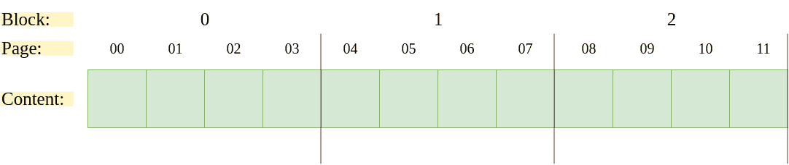
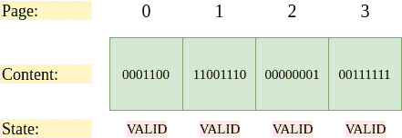
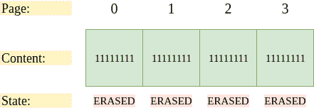
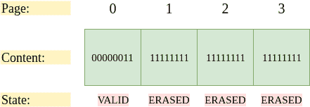

# 基于闪存的固态硬盘(SSD)

> 原文:[https://www . geesforgeks . org/基于闪存的固态硬盘 ssd/](https://www.geeksforgeeks.org/flash-based-solid-state-drive-ssd/)

正如本文[所介绍的](https://www.geeksforgeeks.org/introduction-to-solid-state-drive-ssd/)，固态存储设备(固态硬盘)不包含任何移动部件。与随机存取存储器不同，它们是由晶体管制成的，并且可以在断电的情况下保留信息。 **Flash** 是上世纪 80 年代开发的一项有趣的技术。

**存储位:**
闪存芯片可以在单个晶体管中存储一个或多个位。晶体管中捕获的电荷量被转换成二进制数。根据存储在单个晶体管中的位数，闪存芯片可以有多种类型:

*   **单电平单元(SLC)闪存:**
    晶体管中只存储一个位。因此，位值可以是 0 或 1。
*   **多级单元(MLC)闪存:**
    两个位存储在一个晶体管中。因此，位值可以是 00、01、10 和 11–从最低到最高电荷水平。
*   **三电平单元(SLC)闪存:**
    三位存储在一个晶体管中。

SLC 芯片性能最高，也是三种芯片中最贵的。

**银行和飞机:**
存储一位显然是不够的。因此，闪存芯片被分组到由大量单元组成的**组**或**平面**中。

**银行:**
银行被组织成**区块**和**页面**。块的大小从 128-256 千字节不等，页面约为 4 千字节。下图显示了一个示例闪存芯片，包含 3 个块和每个块 4 页，即总共 3*4 = 12 页。

块和页面结构对于闪存操作极其重要。

**闪击操作:**
下面是闪击操作支持的三种低级操作。

*   **Read:**
    要读取页面，flash 客户端只需指定发出 Read 命令的页码即可。**随机存取**设备允许任何信息被正常和快速地读取，而不管其位置。
*   **擦除:**
    在闪存中写入一页之前，需要擦除相应的整个块。为了擦除一个块，每个位的值被设置为 1。由于必须再次写入数据，因此在执行擦除命令之前，数据会被复制到缓冲区。
*   **程序:**
    擦除一个块后，程序命令将一些 1 变为 0

读一页是最快的命令，大约需要 10 微秒才能完成。编程一个页面是第二快的，大约需要 100 微秒。擦除块是最慢的，因为在块被清空之前，需要将内容复制到缓冲区，并且需要几毫秒才能完成。

**页面状态:**
Flash 页面有关联的“状态”。最初，所有页面都处于无效状态。如果一个块被擦除，该块中的所有页面都将变为擦除状态。这种页面是可编程的，因为它们可以接受写入。当一个页面被编程时，它会变为有效状态。这意味着可以读取页面的内容。

考虑以下包含 4 页的块的初始方向。由于这些页面中的每一个都已经过编程，并且已经有一些数据写入其中，所以它们都处于有效状态。

现在，假设 flash 客户端希望写入第 0 页。要写入任何页面，需要擦除整个块。

擦除整个块后，所有 4 页都处于擦除状态，所有位都设置为 1。最后，我们可以写到第 0 页。

页面 0 现在处于有效状态，因为新数据已经写入其中，并且可以从中读取。其他页面仍处于擦除状态。最后，从临时存储器中读取先前存储在页面 1、2 和 3 中的数据，并将其写回到页面中。

**可靠性问题:**
频繁的写入和擦除导致**磨损**闪存芯片。发生这种情况是因为过量的电荷积聚在闪存块的表面。随着越来越多的电荷累积，很难区分 0 和 1。然后，该块变得不可用，需要丢弃。第二个可靠性问题是**扰动**。发生这种情况是因为当试图在特定页面上读/写数据时，相邻页面中的位翻转。这些也被称为**读取干扰**或**程序干扰**。

**基于闪存的固态硬盘:**
基于闪存的固态硬盘在闪存芯片之上提供了一个读/写数据的接口。固态硬盘包含用于持久存储的闪存芯片；非永久性存储器，例如用于缓存和缓冲的静态随机存取存储器；和控制逻辑来处理闪存操作。**闪存转换层(FTL)** 将客户端读写请求转换为闪存操作，属于低级操作。它本质上是将逻辑操作转换为高可靠性的物理操作。FTL 还帮助解决了上面提到的一些可靠性问题。

*   **处理磨损:**
    FTL 尽可能展开并均匀分布闪光块，使所有块在同一时间左右磨损。
*   **处理干扰:**
    为了在对芯片编程时处理干扰，FTL 采用了顺序编程方法。擦除块按顺序编程，从最低页到最高页，从而覆盖该过程中翻转的任何位。

**日志结构的 FTL:**
与日志结构的文件系统类似，如今大多数 FTL 都是日志结构的，这意味着写入在物理上执行到闪存块之前会在缓冲区中分组在一起。