# 触发器类型及其转换和应用

> 原文:[https://www . geeksforgeeks . org/触发器类型-它们的转换和应用/](https://www.geeksforgeeks.org/flip-flop-types-their-conversion-and-applications/)

触发器是一种保持状态的电路，直到输入指示改变状态。一个基本的触发器可以用四个与非门或四个或非门构成。
**人字拖类型:**

1.  遥感触发器
2.  JK 触发器
3.  d 触发器
4.  触发器

不同类型触发器的逻辑图和真值表如下:

## 开关触发器:

[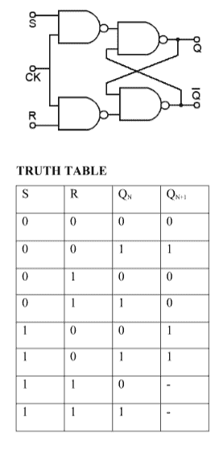](https://media.geeksforgeeks.org/wp-content/cdn-uploads/gq/2017/01/SR_flip.png)

## J-K 触发器:

[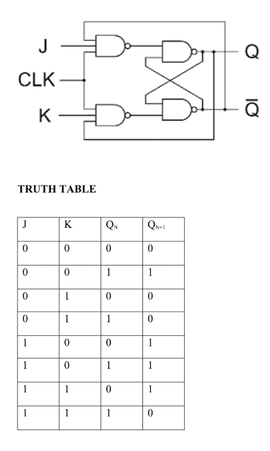](https://media.geeksforgeeks.org/wp-content/cdn-uploads/gq/2017/01/JK_flip.png)

## d 触发器:

[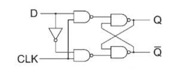](https://media.geeksforgeeks.org/wp-content/cdn-uploads/gq/2017/01/D-logic-diag.png) 

## t 触发器:

[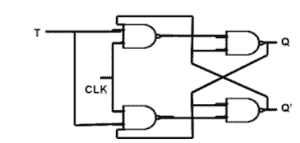](https://media.geeksforgeeks.org/wp-content/cdn-uploads/gq/2017/01/T-logic-diag.png)
[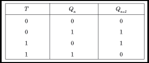](https://media.geeksforgeeks.org/wp-content/cdn-uploads/gq/2017/01/T-flip-flop.png)

## FlipFlops 的转换:-

**励磁表**:

[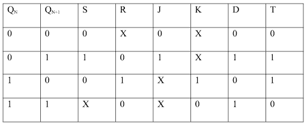](https://media.geeksforgeeks.org/wp-content/cdn-uploads/gq/2017/01/flip_1.png)

**从一个触发器转换到另一个触发器的步骤**:

假设需要使用子触发器构建触发器:

1.  绘制所需触发器的真值表。
2.  从激励表中写入要使用的子触发器的相应输出。
3.  使用所需触发器输入绘制 K 图，并获得子触发器输入的激励函数。
4.  根据得到的函数构造逻辑图。

**i)将 SR 转换为 JK 触发器**

[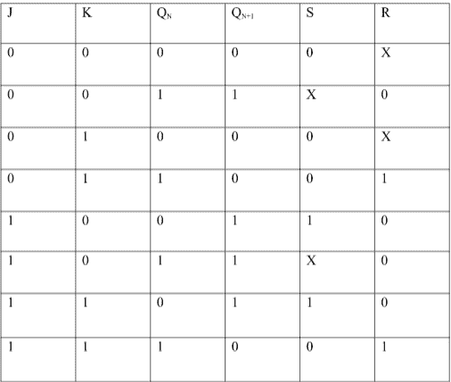](https://media.geeksforgeeks.org/wp-content/cdn-uploads/gq/2017/01/flip_2.png)

**激发功能:**
[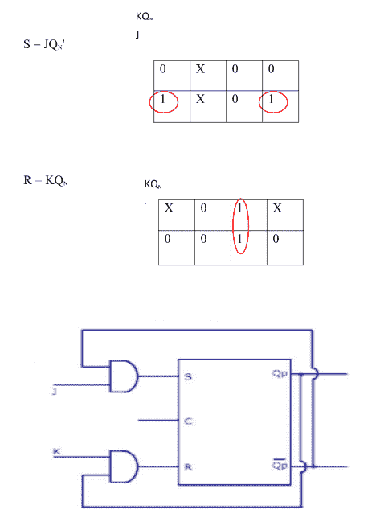](https://media.geeksforgeeks.org/wp-content/cdn-uploads/gq/2017/01/flip_3.png) 

ii)将 SR 转换为 D 触发器:

[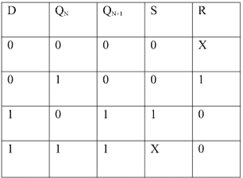](https://media.geeksforgeeks.org/wp-content/cdn-uploads/gq/2017/01/flip_4.png)

**激发功能:**
S = D
R = D'
[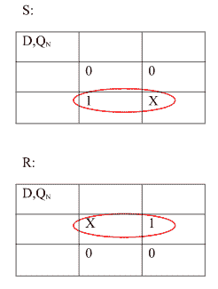](https://media.geeksforgeeks.org/wp-content/cdn-uploads/gq/2017/01/flip_5.png)

[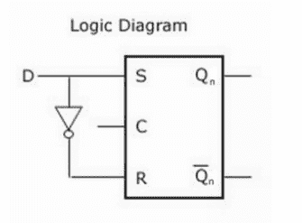](https://media.geeksforgeeks.org/wp-content/cdn-uploads/gq/2017/01/flip_6.png) 

**触发器的应用**
这些是数字电子电路中使用的各种类型的触发器，触发器的应用如下所述。

*   计数器
*   分频器
*   移位寄存器
*   存储寄存器
*   弹跳消除开关
*   数据存储
*   数据传送
*   门闩
*   登记
*   记忆

本文由 **Kriti Kushwaha** 供稿。

如果您发现任何不正确的地方，或者您想分享更多关于上面讨论的主题的信息，请写评论