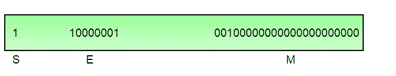

# 浮点表示–基础知识

> 原文:[https://www . geesforgeks . org/浮点表示-基础/](https://www.geeksforgeeks.org/floating-point-representation-basics/)

有关于浮点格式表示的帖子。本文的目的是简要介绍浮点格式。

以下描述解释了 IEEE 754 二进制浮点表示的术语和主要细节。讨论仅限于单精度和双精度格式。

通常，一个二进制的实数将以如下格式表示:

我mIm-1……我 2 I 1 I 0 。F1F2…FnFn-1

其中 I m 和 F n 分别为整数和小数部分的 0 或 1。

一个有限的数也可以用四个整数部分来表示，一个符号(s)，一个基数(b)，一个有效(m)和一个指数(e)。然后该数字的数值被计算为

(-1)sx m x be _ _ _ _ _ _ _ _其中 m < |b|

根据用于编码各种组件的基数和位数， [IEEE 754](http://en.wikipedia.org/wiki/IEEE_754-2008) 标准定义了五种基本格式。在五种格式中，binary32 和 binary64 格式分别是单精度和双精度格式，其中基数为 2。

表-1 精度表示

<figure class="table">

| **精度** | **基地** | **标志** | **指数** | **显著** |
| 单精度 | Two | one | eight | 23+1 |
| 双倍精密度 | Two | one | Eleven | 52+1 |

**单精度格式:**

如表 1 所述，单精度格式有 23 位有效位(1 位代表隐含位，详见下文)，8 位指数位和 1 位符号位。

例如，有理数 9÷2 可以转换为单精度浮点格式，如下所示，

9(10)÷2(10)= 4.5(10)= 100.1(2)

如果用前导 1 位表示，即 1.001 (2) x 2 2 ，则结果称为 ***归一化*** 。(同样，当数字 0.000000001101(2)x 23归一化时，显示为 1.101(2)x 2-6)。省略这个左端隐含的 1 就给了我们浮点数的 ***尾数*** 。归一化的数字比对应的 ***去归一化的*** 数字更准确。隐含的最高有效位可以用来表示更精确的有效位(23 + 1 = 24 位)，称为 ***次正规*** 表示。*浮点数以规范化形式*表示。

次正规数属于非正规数的范畴。次正规表示法略微缩小了指数范围，并且不能被标准化，因为这将导致指数不适合该字段。次正规数不如正规数准确，即它们在分数字段中容纳非零位的空间比正规数小。事实上，随着非正常数字的减小，精确度会下降。然而，次正规表示在填补接近零的浮点标度的空白时是有用的。

换句话说，上述结果可以写成(-1)0x 1.001(2)x 22，其产生的整数分量为 s = 0，b = 2，有效(m) = 1.001，尾数= 001，e = 2。相应的单精度浮点数可以用二进制表示，如下所示，

其中指数字段假定为 2，但编码为 129 (127+2)，称为 ***偏向指数*** 。指数字段是简单的二进制格式，它也用编码表示负指数(如符号幅度、1 的补码、2 的补码等)。).有偏指数用于表示负指数。在执行两个浮点数的按位比较以获得相等性方面，有偏指数比其他负表示有优势。

将(2n-1–1)的 ***偏差*** 加到指数(E)上，得到偏差指数( *E* ),其中 **n** 是指数中使用的位数。所以*单精度*数的偏差指数( *E* )可以得到为

***E = E+127**T3】*

单精度格式的指数范围是-128 到+127。其他值用于特殊符号。

*注意:当我们解包一个浮点数时，得到的指数就是有偏指数。从有偏指数中减去 127，我们可以得到无偏指数。*

**双精度格式:**

如表 1 所述，双精度格式的有效位为 52 位(1 代表隐含位)，指数位为 11 位，符号位为 1 位。对于双精度格式，除了各种组件的大小之外，所有其他定义都是相同的。

**精度:**

浮点表示中能表示的最小变化称为精度。单精度归一化数的小数部分正好有 23 位分辨率(24 位，隐含位)。这对应的是对数(10)(223)= 6.924 = 7(对数的特征)精度的小数位数。同样，对于双精度数字，精度为对数(10)(252)= 15.654 = 16 位十进制数字。

**精度:**

浮点表示的精度由有效位数决定，而范围由指数限制。不是所有的实数都可以用浮点格式精确表示。对于任何不是浮点数的数字，浮点逼近都有两种选择，比如小于 x 的最近浮点数*为 x_ 而大于 x 的最近浮点数*为 x+。基于所选模式，对尾数字段中的有效位数执行 ***舍入*** 操作。 ***向下舍入*** 模式使 x 设置为 x_， ***向上舍入*** 模式使 x 设置为 x+，而 ***向零舍入*** 模式使 x 为 x_ 或 x+,取 0 和之间的值。 ***舍入到最近的*** 模式将 x 设置为 x_ 或 x+最接近 x 的值。通常 ***舍入到最近的*** 是最常用的模式。浮点表示与实际值的接近程度称为 ***精度*** 。**

**特殊位模式:**

该标准定义了一些特殊的浮点位模式。零不能有最高有效的 1 位，因此不能归一化。隐藏位表示需要一种特殊的技术来存储零。对于相同的数值零，我们将有两种不同的位模式+0 和-0。对于单精度浮点表示，下面给出了这些模式，

0 00000000 00000000000000000000000 = +0 

1 00000000 00000000000000000000000 = -0 

类似地，该标准代表了+INF 和-INF 的两种不同的位模式。下面给出了相同的内容，

0 11111111 00000000000000000000000000 =+INF

1 11111111 00000000000000000000000000 =-INF

所有这些特殊数字以及其他特殊数字(如下)都是次正规数字，通过在指数字段中使用特殊的位模式来表示。这稍微缩小了指数范围，但这是可以接受的，因为范围太大了。

计算诸如 0 x INF、0 ÷ INF 等表达式的尝试。没有数学意义。该标准将此类表达式的结果称为非数字。任何带有 NaN 的后续表达式都会产生 NaN。NaN 的表示在指数域中有非零有效和全 1。下面显示的是单精度格式(x 是无关位)，

x 11111111 1**m**0000000000000000000000000000000000000000000000000000000000000000000000000

其中 ***m*** 可以是 0 或 1。这给了我们 NaN 的两种不同表示。

0 11111111 11000000000000000000000000000000000000000000000000000000000000000000000000000000000000

0 11111111 10000000000000000000000000000000000000000000000000000000000000000000000000000000000000

通常 QNaN 和 SNaN 用于错误处理。QNaN 不会引发任何异常，因为它们会在大多数操作中传播。而 SNaN 在被大多数操作使用时会引发无效异常。

**上溢和下溢:**

**溢出据说发生在算术运算的真实结果是有限的，但在数量上大于使用给定精度可以存储的最大浮点数时。 ***下溢*** 被认为是当算术运算的真实结果在幅度上(无穷小)小于可以存储的最小归一化浮点数时发生的。计算中不能忽略溢出，而下溢可以有效地被零代替。**

****字符顺序:****

**IEEE 754 标准定义了二进制浮点格式。架构细节留给硬件制造商。二进制浮点数中各个字节的存储顺序因体系结构而异。**

**感谢[文基](http://www.linkedin.com/in/ramanawithu)撰写以上文章。如果你发现任何不正确的地方，或者你想分享更多关于上面讨论的话题的信息，请写评论。** 

</figure>