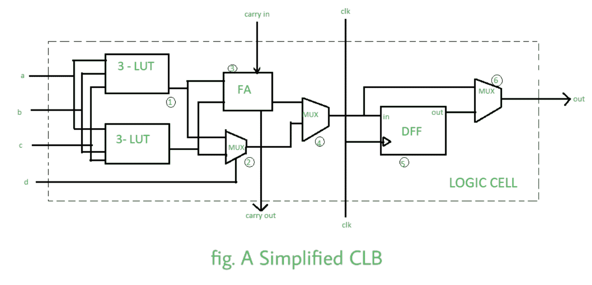

# 现场可编程门阵列全形式

> 原文:[https://www.geeksforgeeks.org/fpga-full-form/](https://www.geeksforgeeks.org/fpga-full-form/)

FPGA 代表**现场可编程门阵列**，这是一种可以被编程为针对特定应用执行定制操作的集成电路。他们有成千上万个门。在超大规模集成电路领域，FPGAs 已经非常流行。用 VHDL、Verilog 等语言编写 FPGA 编程的代码。

**架构:**
它由数千个被称为可配置逻辑块(CLB)的基本元件组成，这些元件被一个被称为结构的可编程互连系统包围，该系统在 CLB 和输入/输出块之间引导信号，并在现场可编程门阵列和外部设备之间接口。

逻辑模块由[多路复用器](https://www.geeksforgeeks.org/multiplexers-in-digital-logic/)、[全加器](https://www.geeksforgeeks.org/full-adder-in-digital-logic/)、D 触发器、查找表(LUT)组成，查找表是 FPGA 的基本构建模块。查找表确定任何给定输入源的输出。4-6 位输入的 lut 被广泛使用，经过实验甚至可以达到 8 位。d 触发器存储 LUT 的输出。

现场可编程门阵列的类型根据其应用，现场可编程门阵列分为:

1.  **低端 FPGA–**
    它们比另外两个消耗更少的能量，并且因为没有栅极而不那么复杂。
2.  **中端 FPGA–**
    它们比低端 FPGA 功耗更高，门电路数量更多，因此更复杂。它们提供了性能和成本之间的平衡。
3.  **高端 FPGA–**
    它们的栅极密度很大，因此比中端更复杂。他们的性能比低端和中端平板电脑要好一些高端平板电脑。

**优势:**

*   FPGAs 比一般的 CPU 提供更好的性能，因为它们能够处理并行处理。
    FPGA 是可重编程的。
*   它们具有成本效益。
*   FPGAs 允许您在很短的时间内完成产品的开发，因此它们可以在更短的时间内上市。

**缺点:**

*   它们的功耗很高，程序员无法控制功耗优化。
*   FPGA 的编程没有 C 编程那么简单。
*   它们只在产量低的地方使用。

**应用:**
FPGA 用于国防设备中，用于 SDRs 中的图像处理、ASIC 原型制作、高性能计算机、无线通信，如 WiMAX、WCDMA 等。和医疗领域中用于诊断和治疗的各种设备中。它们也用于消费电子产品，如平板显示器、家用机顶盒等。