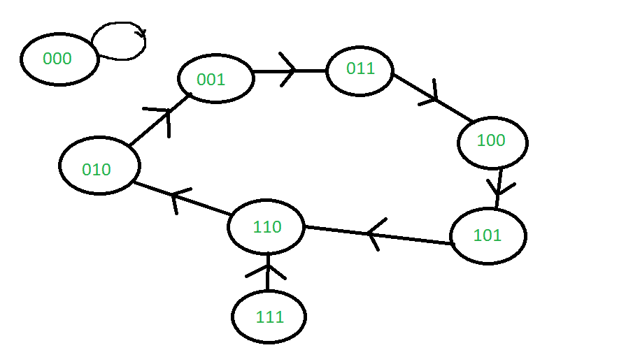

# 自由跑计数器

> 原文:[https://www.geeksforgeeks.org/free-running-counter/](https://www.geeksforgeeks.org/free-running-counter/)

[计数器](https://www.geeksforgeeks.org/counters-in-digital-logic/)是存储特定事件或过程发生次数的设备。顾名思义，计数器是一种用于“计数”的设备——主要与时钟信号有关。

如果计数器包含计数器循环中所有可能的状态，则称它是自由运行的。计数器产生的数字序列中最长的循环被称为主计数循环。如果主计数循环扩展并覆盖所有状态，那么只有这样计数器才称为自由运行。换句话说，主计数循环应该覆盖整个序列。

**自由运行计数器:**
自由运行计数器是在任何时间点都不需要任何外部干扰而运行的计数器。如果至少有一个点位于主计数循环之外，那么需要某种额外的努力来迫使它回到主循环。

**示例:**

在这个例子中，主要的计数循环是整个序列——它覆盖了序列中的所有状态。因此它是一个自由运行的计数器。

在本例中，子序列 01->10->11->01 是该序列的主要计数循环。因为状态 00 不是主计数循环的一部分，所以它不是自由运行的计数器。

本例中的主要计数循环是 010-> 001-> 011-> 100-> 101-> 110-> 010。因为状态 111 和 000 不构成主计数循环的一部分，所以它不是自由运行循环。