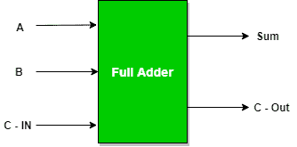
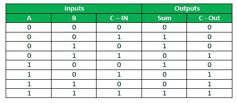
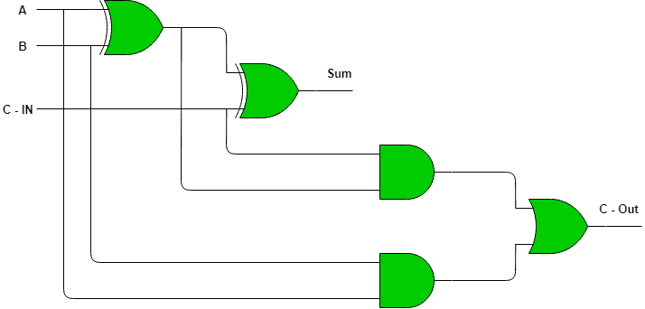
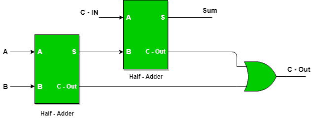

# 数字逻辑中的全加器

> 原文:[https://www.geeksforgeeks.org/full-adder-in-digital-logic/](https://www.geeksforgeeks.org/full-adder-in-digital-logic/)

全加器是将三个输入相加并产生两个输出的加法器。前两个输入是 A 和 B，第三个输入是作为 C-IN 的输入进位。输出进位被指定为 C-OUT，正常输出被指定为 S，即 SUM。
全加器逻辑的设计方式是，可以将八个输入放在一起，创建一个字节宽的加法器，并将进位从一个加法器级联到另一个加法器。

**全加器真值表:**

**SUM 的逻辑表达式:**
= A ' B ' C-IN+A ' B C-IN '+A B ' C-IN '+A B C-IN
= C-IN(A ' B '+A B)+C-IN '(A ' b+ A B ')
= C-IN XOR(A XOR B)
=(1，2，4，7)

**C-OUT 的逻辑表达式:**
= A ' B C-IN+A B ' C-IN+A B C-IN '+A B C-IN
= A b+ B C-IN+A C-IN
=(3，5，6，7)

**可以实现 C-OUT 的另一种形式:**
= A b+ A C-IN+B C-IN(A+A’)
= A B C-IN+A b+ A C-IN+A ' B C-IN
= A B(1+C-IN)+A C-IN+A ' B C-IN
= A b+ A C-IN+A ' B C-IN
= A b+ A C-IN(b+ B’) +A ' B C-IN
= A B C-IN+A b+ A B ' C-IN+A ' B C-IN
= A B(C-IN+1)+A B ' C-IN+A ' B C-IN
= A b+ A B ' C-IN+A ' B C-IN
= A b+ C-IN(A ' b+ A B ')
因此 COUT = A b+ C-IN(A EX–OR B)

全加器逻辑电路。

**使用半加法器实现全加器**
需要 2 个半加法器和一个或门来实现全加器。

利用这种逻辑电路，两位可以相加在一起，从下一个较低的数量级取一个进位，并向下一个较高的数量级发送一个进位。

**使用与非门实现全加器:**

**使用或非门实现全加器:**
实现全加器总共需要 9 个或非门。

本文由**苏穆利·乔杜里**供稿