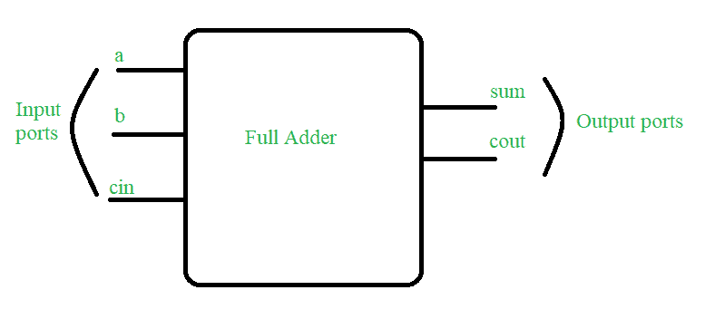

# 使用 Verilog HDL 的全加器

> 原文:[https://www.geeksforgeeks.org/full-adder-using-verilog-hdl/](https://www.geeksforgeeks.org/full-adder-using-verilog-hdl/)

在本文中，我们将讨论使用 Verilog HDL 的全加器的概述部分。目的是理解全加器的概念，并用 Verilog HDL 代码实现。我们一个一个来讨论。

**先决条件*****–***[数字逻辑中的全加器](https://www.geeksforgeeks.org/full-adder-in-digital-logic/)

**问题陈述:**
写一个 [Verilog HDL](https://www.geeksforgeeks.org/difference-between-verilog-and-systemverilog/) 来设计全加器。下面我们一步一步讨论。

**Step-1 :**
**概念图–**
全加器是一种数字组合电路，它有三个输入 a、b 和 cin，两个输出 sum 和 cout。下面的真值表显示了全加器的功能。



图为设计要求框图:全加器

**第 2 步:**
**真值表–**

<figure class="table">

| a | b | cin | 总和 | 标准输出 |
| --- | --- | --- | --- | --- |
| Zero | Zero | Zero | Zero | Zero |
| Zero | Zero | one | one | Zero |
| Zero | one | Zero | one | Zero |
| Zero | one | one | Zero | one |
| one | Zero | Zero | one | Zero |
| one | Zero | one | Zero | one |
| one | one | Zero | Zero | one |
| one | one | one | one | one |

**第 3 步:**
**全加器 Verilog HDL 代码(设计部分)–**

```
// Code your design : Full Adder
module full_add(a,b,cin,sum,cout);
  input a,b,cin;
  output sum,cout;
  wire x,y,z;

// instantiate building blocks of full adder 
  half_add h1(.a(a),.b(b),.s(x),.c(y));
  half_add h2(.a(x),.b(cin),.s(sum),.c(z));
  or o1(cout,y,z);
endmodule : full_add

// code your half adder design             
module half_add(a,b,s,c); 
  input a,b;
  output s,c;

// gate level design of half adder  
  xor x1(s,a,b);
  and a1(c,a,b);
endmodule :half_add
```

**第 4 步:**
**试验台–**

```
// Code your testbench here
module full_add_tb;
  reg a,b,cin;
  wire sum,cout;

// instantiate the DUT block  
  full_add f1(.a(a),.b(b),.cin(cin),.sum(sum),.cout(cout));

// this particular line is added to dump the file on online simulator
  initial begin $dumpfile("full_tb.vcd");$dumpvars(); end

// insert all the inputs 
  initial begin a=1'b1;  #4; a=1'b0;#10 $stop();end
  initial begin b=1'b1; forever #2 b=~b;end
  initial begin cin=1'b1;forever #1 cin=~cin; #10 $stop();end

// monitor all the input and output ports at times 
// when any of the input changes its state

 initial begin $monitor(" time=%0d A=%b B=%b 
                          Cin=%b Sum=%b Cout=%b",$time,a,b,cin,sum,cout);end
 endmodule : full_add_tb
```

**第 5 步:**
**预期产出–**

```
time=0 A=1 B=1 Cin=1 Sum=1 Cout=1
time=1 A=1 B=1 Cin=0 Sum=0 Cout=1
time=2 A=1 B=0 Cin=1 Sum=0 Cout=1
time=3 A=1 B=0 Cin=0 Sum=1 Cout=0
time=4 A=0 B=1 Cin=1 Sum=0 Cout=1
time=5 A=0 B=1 Cin=0 Sum=1 Cout=0
time=6 A=0 B=0 Cin=1 Sum=1 Cout=0
time=7 A=0 B=0 Cin=0 Sum=0 Cout=0
time=8 A=0 B=1 Cin=1 Sum=0 Cout=1
time=9 A=0 B=1 Cin=0 Sum=1 Cout=0
time=10 A=0 B=0 Cin=1 Sum=1 Cout=0
time=11 A=0 B=0 Cin=0 Sum=0 Cout=0
time=12 A=0 B=1 Cin=1 Sum=0 Cout=1
time=13 A=0 B=1 Cin=0 Sum=1 Cout=0
```

</figure>