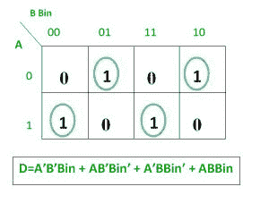
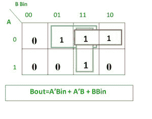
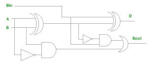
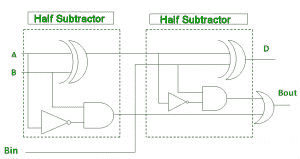

# 数字逻辑中的全减法器

> 原文:[https://www . geesforgeks . org/全数字逻辑减法器/](https://www.geeksforgeeks.org/full-subtractor-in-digital-logic/)

全减法器是一种**组合电路**，它对两个位执行减法，一个是被减数，另一个是减数，同时考虑到前一个相邻的较低被减数位的借用。该电路**有三个输入和两个输出**。三个输入 A、B 和 Bin 分别表示被减数、减数和前一次借用。两个输出 D 和 Bout 分别代表差值和输出借用。


**真值表–**


从上表中我们可以画出“差异”和“借用”的 k 线图。



**差异的逻辑表达式–**

```
D   = A’B’Bin + A’BBin’ + AB’Bin’ + ABBin
    = Bin(A’B’ + AB)  + Bin’(AB’ + A’B)
    = Bin( A XNOR B) + Bin’(A XOR B)
    = Bin (A XOR B)’  +  Bin’(A XOR B)
    = Bin XOR (A XOR B)
    = (A XOR B) XOR Bin

```

**借用的逻辑表达式–**

```
Bout = A’B’Bin + A’BBin’ + A’BBin + ABBin      
     = A’B’Bin +A’BBin’ + A’BBin + A’BBin + A’BBin + ABBin
     = A’Bin(B + B’) + A’B(Bin + Bin’) + BBin(A + A’)
     = A’Bin + A’B + BBin

OR

Bout = A’B’Bin + A’BBin’ + A’BBin + ABBin      
     = Bin(AB + A’B’) + A’B(Bin + Bin’)
     = Bin( A XNOR B) + A’B
     = Bin (A XOR B)’ + A’B

```

**全减法器的逻辑电路–**


**使用半减法器实现全减法器**–
需要 2 个半减法器和一个或门来实现全减法器。


**参考-**[全减法器-维基百科](https://en.wikipedia.org/wiki/Subtractor#Full_Subtractor)

本文由 **Harshita Pandey** 供稿。如果你喜欢 GeeksforGeeks 并想投稿，你也可以使用[contribute.geeksforgeeks.org](http://www.contribute.geeksforgeeks.org)写一篇文章或者把你的文章邮寄到 contribute@geeksforgeeks.org。看到你的文章出现在极客博客主页上，帮助其他极客。

如果你发现任何不正确的地方，或者你想分享更多关于上面讨论的话题的信息，请写评论。