# 数字逻辑中的功能完备性

> 原文:[https://www . geesforgeks . org/functional-completion-in-digital-logic/](https://www.geeksforgeeks.org/functional-completeness-in-digital-logic/)

当且仅当**的每一个**切换功能都可以通过其中的操作来表达时，一组**操作**被称为功能完备或通用。一组布尔函数在功能上是完整的，如果所有其他布尔函数都可以从这个集合中构造，并且提供了一组输入变量，例如

*   集合 A = {+，*，'(OR，AND，complete 在功能上是完备的。
*   集合 B = {+，' }在功能上是完整的
*   集合 C = {*，' }在功能上是完整的

**波斯特的函数完备性定理–**函数的重要闭类:

1.  t0–所有保 0 函数的类，如 f(0，0，…，0) = 0。
2.  t1–所有保 1 函数的类，如 f(1，1，…，1) = 1。
3.  s–一类自对偶函数，如 f(x 1 ，…，x n ) = f( x 1 ，…，x n 。
4.  m–单调函数类，例如:{x 1 ，…，x n } ≤ {x 1 ，…，x n }，if xI≤yI
    if { x1，…，x n } ≤ {x 1 ，…，x n
5.  l–线性函数类，可表示为:f(x 1 ，…，xn)= a0+a1x1+…+anxn；a i {0，1}。

**定理–**对于五个定义的类 T 0 、T 1 、S、M、L 中的每一个，当且仅当 F 中有一个成员不属于该类时，布尔函数系统在功能上是完备的。

这些是最小的功能完备的操作集–

**一个元素–**
{﹍}、{﹍}。

**两个元素–**
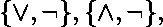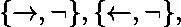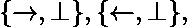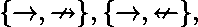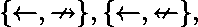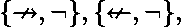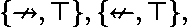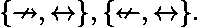

**三要素–**
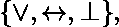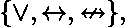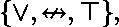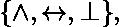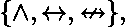

**功能完整性示例–**

*   **检查函数 F(A，B，C) = A'+BC '是否功能完备？**
*   **解释–**让我们从把所有变量都设为‘A’开始，这样它就变成了
    F(A，A，A)= ' A '+A . A ' = A '—(I)
    F(B，B，B)= ' B '+B . B ' = B '—(ii)
    现在用 F(A，A，A)代替变量‘A’，用 F(B，B，B)代替变量‘C’
    F(A，A，A)，B，F
*   **检查函数 F(A，B) = A'+B 是否功能完备？**
*   **解释–**让我们从把所有变量都设为‘A’开始，这样它就变成了
    F(A，A)= ' A '+A = 1—-(I)
    F(B，B)= ' B '+B = 1—(ii)
    F(A，0) = A'+0 = A'—(iv)
    现在用 F(A，0)代替变量‘A’
    F(F(A，0)，B)=(A ')’+B = A+B—(T0)
*   **检查函数 F(A，B) = A'B 是否功能完备？**
*   **Explanation –** Let us start by putting all variables as ‘A’ so it becomes
    F(A,A) = A’.A’ = 0—-(i)
    F(A,0) = A’.0 = 0—(ii)
    F(A,1) = A’.1 = A’—(iv)
    Now substitute F(A,1) in place of variable ‘A’
    F(F(A,1),B) = (A’)’*B = A*B—(iii)
    from (iv) complement is derived and from (iii) operator ‘*’ is derived so this function is functionally complete as from above if function contains {*,’} is **partially functionally complete** .

    **注意–**如果通过替换‘0’或‘1’功能变得完整，则称其为部分功能完整。

*   **检查函数 F(A，B) = A'B+AB' (EX-OR)是否功能完备？**
*   **解释–**让我们从把所有变量都作为‘A’开始，这样它就变成了
    F(A，1)= A . . 1+A . 0 = A’——(I)
    F(A’，B)= AB+A‘B’–(ii)
    F(A’，B’= AB’+A‘B–(iii)
    F(A，B’= A‘B’+AB—(iv)
    所以没有办法得到{+，*，’}根据所以 **EX-OR 不是功能完整的**。
*   **考虑运算
    f(X，Y，Z) = X'YZ + XY' + Y'Z '和 g(X '，Y，Z)= X ' YZ+X ' YZ '+XY
    以下哪一项是正确的？**
    (A)两个{f}和{g}都是功能完备的
    (B)只有{f}是功能完备的
    (C)只有{g}是功能完备的
    (D)无论是{f}还是{g}都不是功能完备的
*   **说明–**见 [GATE CS 2015(第 1 集)|问题 65](https://www.geeksforgeeks.org/gate-gate-cs-2015-set-1-question-49/)

**参考文献–**
[波斯特的功能完备性定理](https://cs.hse.ru/data/2015/05/28/1096847873/Lecture%2013.1.pdf)
[功能完备性–维基百科](https://en.wikipedia.org/wiki/Functional_completeness)

本文由**瓦伊沙里·巴蒂亚**供稿。如果你喜欢 GeeksforGeeks 并想投稿，你也可以使用[contribute.geeksforgeeks.org](http://www.contribute.geeksforgeeks.org)写一篇文章或者把你的文章邮寄到 contribute@geeksforgeeks.org。看到你的文章出现在极客博客主页上，帮助其他极客。

发现有不正确的地方请写评论

>