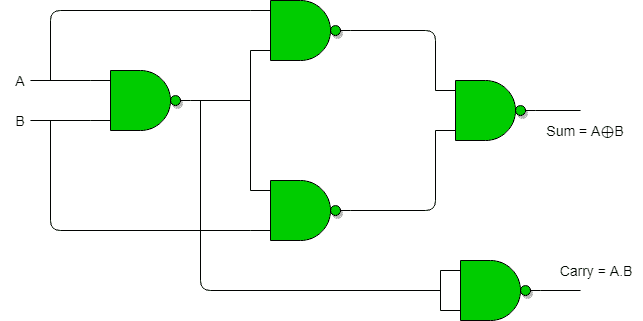
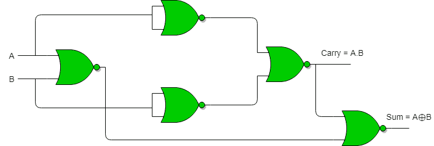
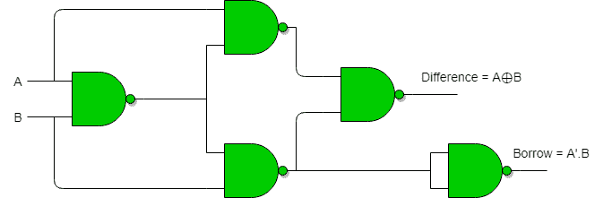
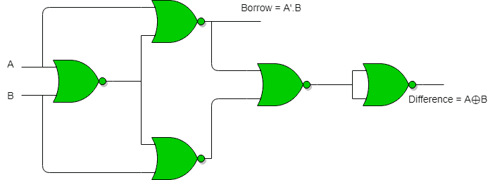

# 使用与非门或非门的半加法器和半减法器

> 原文:[https://www . geeksforgeeks . org/半加半减使用与非门/](https://www.geeksforgeeks.org/half-adder-half-subtractor-using-nand-nor-gates/)

**使用与非门实现半加法器:**
总共需要 5 个与非门来实现半加法器。

**使用或非门实现半加法器:**
实现半加法器总共需要 5 个或非门。

**使用与非门实现半减法器:**
总共需要 5 个与非门来实现半减法器。

**使用或非门实现半减法器:**
总共需要 5 个或非门来实现半减法器。

本文由**苏穆利·乔杜里**供稿