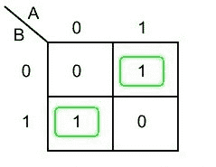
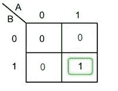
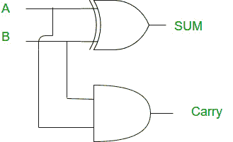

# 数字逻辑中的半加法器

> 原文:[https://www.geeksforgeeks.org/half-adder-in-digital-logic/](https://www.geeksforgeeks.org/half-adder-in-digital-logic/)

半加法器

2 位的加法是用一种叫做半加法器的组合电路完成的。输入变量是被加数和加数位，输出变量是求和和进位位。a 和 B 是两个输入位。

**真值表:**

这里我们执行两个运算求和和进位，因此我们需要两个 K-映射，每个映射一个来导出表达式。

**逻辑表达式:**

**1)为 Sum:**

**和=甲异或乙**

**2)为进位:**

**进位= A 和 B**

**实施:**

**注:**

半加法器只有两个输入端，当执行多重加法时，不需要添加来自低位的进位。

如果发现有不正确的地方，请写评论，或者想分享更多关于以上讨论话题的信息