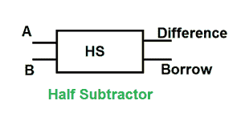
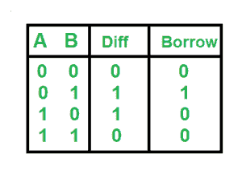

# 数字逻辑中的半减法器

> 原文:[https://www . geesforgeks . org/数字逻辑半减法器/](https://www.geeksforgeeks.org/half-subtractor-in-digital-logic/)

半减法器

真值表

逻辑表达式

差=异或 B
借=

履行

如果您发现任何不正确的地方，或者您想分享更多关于上面讨论的主题的信息，请写评论