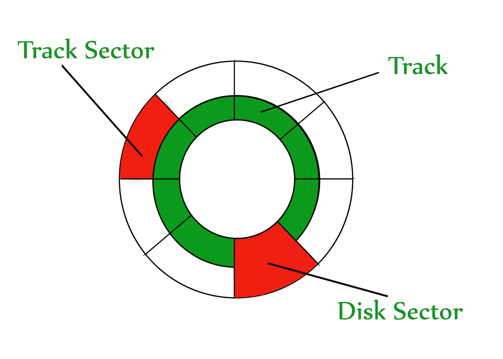

# 硬盘(HDD)辅助存储器

> 原文:[https://www . geeksforgeeks . org/硬盘-驱动器-HDD-辅助-内存/](https://www.geeksforgeeks.org/hard-disk-drive-hdd-secondary-memory/)

硬盘是一种内存存储设备，如下所示:

磁盘分为**磁道**。每个轨道进一步划分为**扇区**。这里需要注意的一点是，外部磁道的大小大于内部磁道，但是它们包含相同数量的扇区，并且具有相同的存储容量。这是因为在内部轨道的扇区中存储密度高，因为比特稀疏地排列在外部轨道的扇区中。每个扇区的一些空间用于格式化。因此，一个扇区的实际容量小于给定容量。

读写头在旋转硬盘上移动。读写磁头在磁盘上执行所有读写操作，因此读写磁头的位置是一个主要问题。要在内存位置上执行读或写操作，我们需要将读写头放在该位置上。这里必须注意一些重要术语:

1.  **寻道时间–**读写头从其当前位置到达所需磁道所用的时间。
2.  **旋转延迟–**扇区进入读写磁头下所花费的时间。
3.  **数据传输时间–**传输所需数据量所需的时间。这取决于转速。
4.  **控制器时间–**控制器所花费的处理时间。
5.  **平均访问时间–**寻道时间+平均旋转延迟+数据传输时间+控制器时间。

**注:**平均旋转潜伏期大多为 1/2*(旋转潜伏期)。

在问题中，如果没有提到寻道时间和控制器时间，请将它们设为 0。

如果未给出要传输的数据量，则假设没有数据正在传输。否则，计算传输给定数据量所需的时间。

旋转延迟的平均值是在没有给出读写头的当前位置时获得的。因为，读写头可能已经出现在所需的位置，或者可能需要旋转一整圈才能在读写头下获得所需的扇区。但是，如果给出了读写头的当前位置，则必须计算旋转延迟。

**示例–**
考虑一个硬盘，它有:
4 个表面
64 个磁道/表面
128 个扇区/磁道
256 个字节/扇区

1.  硬盘的容量是多少？
    磁盘容量=表面*磁道/表面*扇区/磁道*字节/扇区
    磁盘容量= 4 * 64 * 128 * 256
    磁盘容量= 8 MB
2.  磁盘以 3600 转/分的速度旋转，数据传输速率是多少？
    60 秒- > 3600 转
    1 秒- > 60 转
    数据传输速率=每秒转数*磁道容量*表面数量(因为每个表面使用 1 个读写头)
    数据传输速率= 60 * 128 * 256 * 4
    数据传输速率= 7.5 MB/秒
3.  磁盘以 3600 转/分的速度旋转，平均访问时间是多少？
    由于未给出寻道时间、控制器时间和要传输的数据量，因此我们将这三项都视为 0。
    因此，平均访问时间=平均旋转延迟
    旋转延迟= > 60 秒- > 3600 转
    1 秒- > 60 转
    旋转延迟= (1/60)秒= 16.67 毫秒。
    平均旋转延迟= (16.67)/2
    = 8.33 毫秒。
    平均访问时间= 8.33 毫秒。
4.  再比如: [GATE IT 2007 |问题 44](https://www.geeksforgeeks.org/gate-gate-it-2007-question-44/)