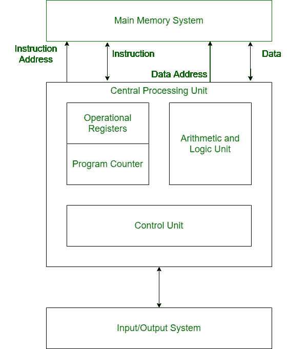

# 哈佛建筑

> 原文:[https://www.geeksforgeeks.org/harvard-architecture/](https://www.geeksforgeeks.org/harvard-architecture/)

在遵循冯·诺依曼架构的普通计算机中，指令和数据都存储在同一个内存中。所以同样的总线被用来获取指令和数据。这意味着 CPU 不能同时做这两件事(读取指令和读/写数据)。**哈佛架构**是包含独立存储和用于指令和数据的独立总线(信号路径)的计算机架构。它基本上是为了克服冯·诺依曼架构的瓶颈而开发的。指令和数据有独立总线的主要优点是 CPU 可以同时访问指令和读/写数据。

**哈佛建筑结构:**

*   **公交车:**
    公交车用作信号通道。在哈佛体系结构中，指令和数据都有独立的总线。总线类型:
    **数据总线:**它在主存储系统、处理器和输入输出设备之间传输数据。
    **数据地址总线:**它把数据的地址从处理器传送到主存系统。
    **指令总线:**它在主存系统、处理器和 I/O 设备之间传递指令。
    **指令地址总线:**它把指令的地址从处理器传送到主存系统。
*   **操作寄存器:**
    其中涉及不同类型的寄存器，用于存储不同类型指令的地址。
    例如，存储器地址寄存器和存储器数据寄存器是操作寄存器。
*   **程序计数器:**
    它有下一条要执行的指令的位置。然后，程序计数器将这个下一个地址传递给存储器地址寄存器。
*   **算术和逻辑单元:**
    算术逻辑单元是中央处理器中运行所有所需计算的部分。它执行加法、减法、比较、逻辑运算、移位运算和各种算术运算。
*   **控制单元:**
    控制单元中央处理器中操作所有处理器控制信号的部分。它控制输入和输出设备，还控制系统内指令和数据的移动。
*   **输入输出系统:**
    输入设备用于在 CPU 输入指令的帮助下将数据读入主存。计算机输出的信息通过输出设备给出。计算机在输出设备的帮助下给出计算结果。

**哈佛架构的优势:**
哈佛架构有两条独立的指令和数据总线。因此，中央处理器可以同时访问指令和读/写数据。这是哈佛建筑的主要优势。

实际上，在我们有两个独立的缓存(数据和指令)的地方，使用了修改后的哈佛架构。这是常见的，用于 X86 和 ARM 处理器。