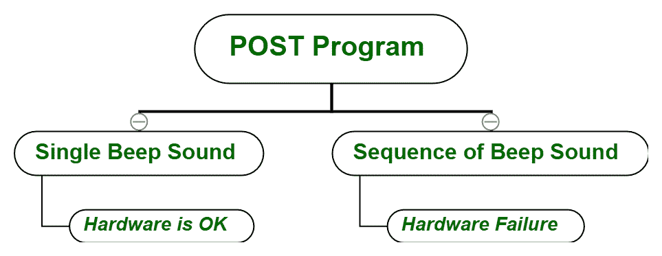

# 电脑/笔记本电脑如何启动？

> 原文:[https://www.geeksforgeeks.org/how-computer-laptop-starts/](https://www.geeksforgeeks.org/how-computer-laptop-starts/)

我们总是一按下笔记本电脑或 PC 的电源按钮，甚至不去想一按电源按钮笔记本电脑内部到底发生了什么，这是怎么导致电脑启动的呢？有哪些组件可以帮助我们的系统启动？等等。因此，今天在这篇文章中，我们将了解计算机是如何真正开始的？

**必备词汇:**

*   母板
*   闪存
*   基本输入输出系统
*   引导加载程序

**主板:**
这是一个电路板或主逻辑板，其中安装计算机所需的不同组件被开槽并焊接在一起。这是计算机硬件中最关键、最复杂的部分之一。
附带的组件有:[内存](https://www.geeksforgeeks.org/random-access-memory-ram-and-read-only-memory-rom/)、[只读存储器](https://www.geeksforgeeks.org/classification-and-programming-of-read-only-memory-rom/)、闪存、USB 端口等。

**闪存:**
这是一种非易失性存储器，闪存是由 EEPROM 存储器(1 位)制成的常规闪存(1 位)。每年出货 250 亿个闪存单元。将 1 写入 0 需要 50 到 100 纳秒。

**BIOS :**
在任何笔记本电脑或 PC 上运行的第一个程序是 BIOS(基本输入/输出系统)。它检查所有设备和驱动程序，并帮助维护从操作系统到连接设备的数据流，反之亦然。
BIOS 是硬件相关程序，因此由制造商提供。

**Boot Loader:**
Boot Loader 是找到操作系统并加载启动的程序。

电脑如何启动？

*   **步骤 1:**
    电源按钮打开。
*   **步骤 2:**
    给主板和其他硬件组件通电。
*   **Step-3:**
    Flash memory get power and BIOS present on Flash run a program called POST stands for **Power On Self Test**. This program check for hardware failure, if there is a single beep sound then hardware is OK but if there is a sequence of beep sound i.e. hardware failure.

    

    
**Figure –** POST Program

*   **步骤-4:**
    BIOS 在存储设备的第一个扇区中搜索引导加载程序，如[硬盘](https://www.geeksforgeeks.org/hard-disk-drive-hdd-secondary-memory/)。如果它得到引导加载程序，基本输入输出系统加载这个引导加载程序到内存。
*   **步骤-5:**
    引导加载器现在搜索操作系统并加载它以开始。
*   **第 6 步:**
    操作系统加载到用户手中。

任何电脑或笔记本电脑都是这样启动的。