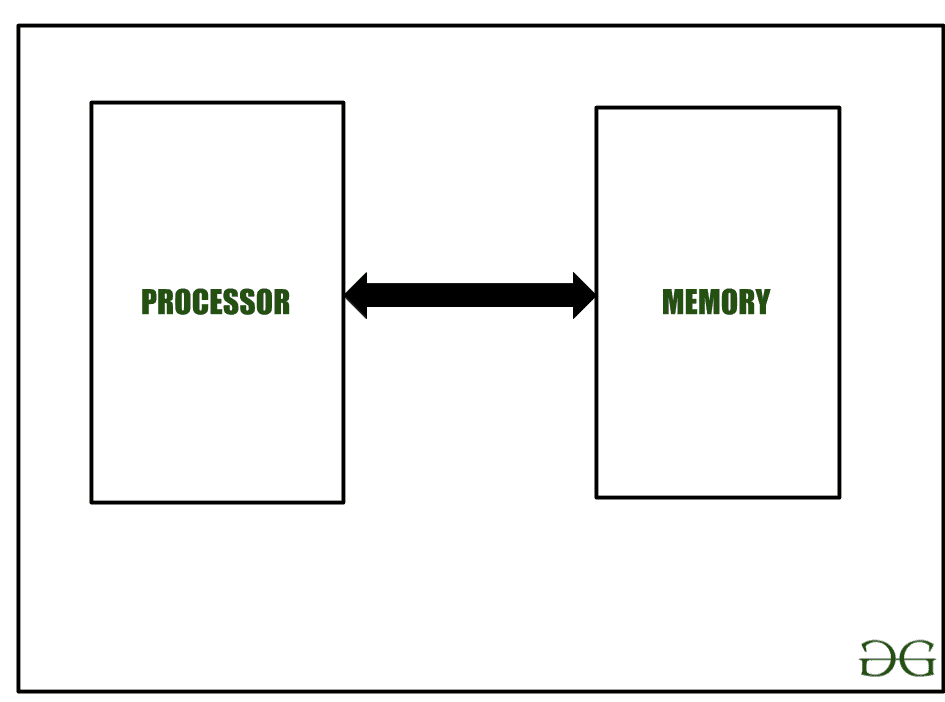
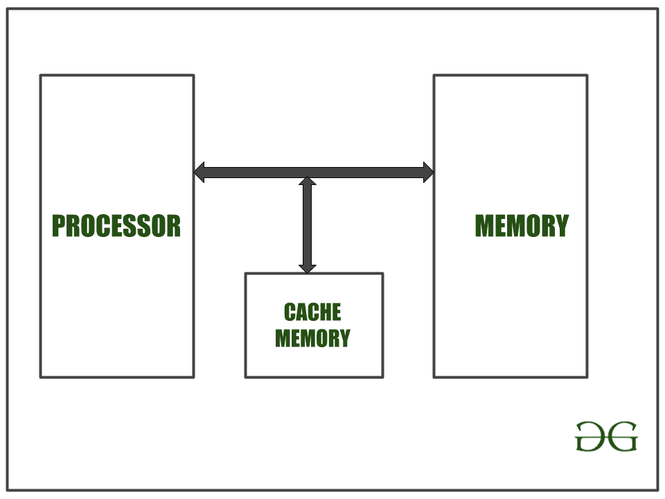
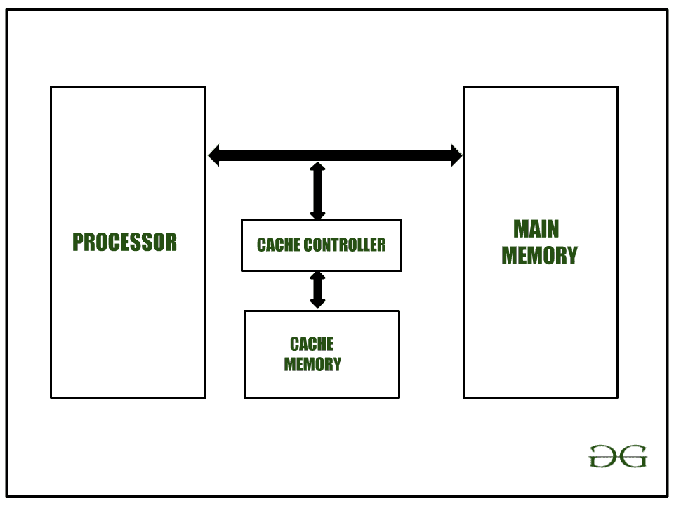
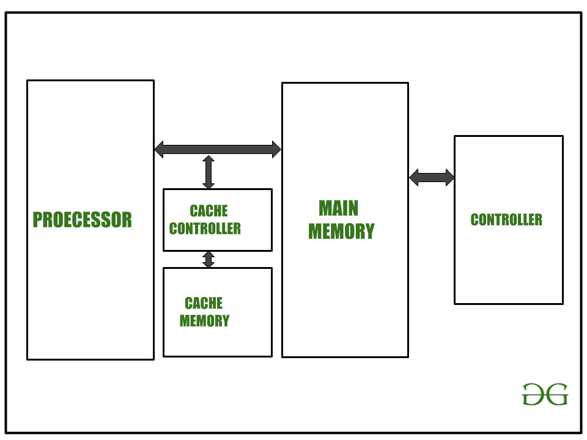
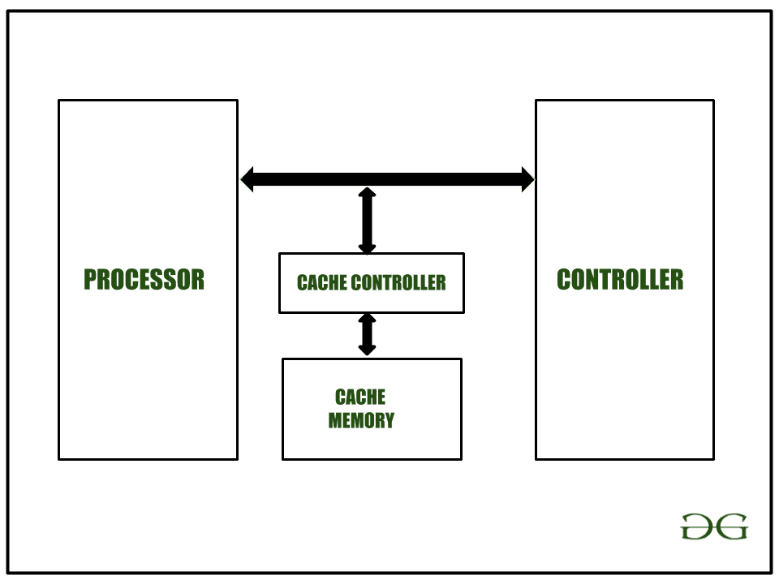

# C 的 Volatile 限定符在计算系统

中是如何工作的

> 原文:[https://www . geesforgeks . org/how-do-volatile-qualifier-of-c-work in-computing-system/](https://www.geeksforgeeks.org/how-does-volatile-qualifier-of-c-works-in-computing-system/)

**先决条件:** [**计算系统**](https://www.geeksforgeeks.org/computer-architecture-flynns-taxonomy/)[**处理单元**](https://www.geeksforgeeks.org/difference-between-cpu-and-gpu/)

### **处理单元:**

*   处理单元也有一些叫做寄存器的小内存。
*   处理器(处理单元)和内存之间的接口应该以相同的速度工作，以获得更好的系统性能。

### **记忆:**

在内存中，有两种类型，静态随机存取存储器和动态随机存取存储器。静态随机存取存储器成本高但速度快，动态随机存取存储器成本低但速度慢。最初，静态随机存取存储器被用作存储器。当内存大小开始增加时，动态随机存取存储器的使用就增加了，今天只有动态随机存取存储器被用作主存储器。

[](https://media.geeksforgeeks.org/wp-content/uploads/20200723105014/Articlework11.png)

在此期间，处理器速度提高了，但内存速度却没有提高。因此，即使处理器速度提高，系统性能也没有提高。为了解决这个问题，设计人员在处理器和主存储器之间引入了高速静态随机存取存储器。

[](https://media.geeksforgeeks.org/wp-content/uploads/20200723105918/Untitleddrawing.png)

该内存称为**缓存**。因为静态随机存取存储器很贵，所以静态随机存取存储器的尺寸很小。它只存储来自主存储器的最近访问。为了存储最近的访问并检查缓存中的内容是否可用，设计中包括了**缓存控制器**。

[](https://media.geeksforgeeks.org/wp-content/uploads/20200723111028/Untitleddrawing1.png)

处理器可以整体禁用缓存控制器，也可以指示缓存控制器缓存或不缓存任何特定的内存块。

下面是存储在内存中的数据示例:

## C

```
// C program to execute for loop 100 times
#include <stdio.h>

// Driver Code
int main()
{
    int i, j;
    j = 0;

    // For loop execute 100 times
    for (i = 0; i < 100; i++) {
        j = j + i;
    }
    return 0;
}
```

**解释:**
在上面的代码中，当 for 循环执行 100 次时，第一次从主存中取出变量，剩余的 99 次变量从[缓存](https://www.geeksforgeeks.org/cache-memory-in-computer-organization/)中取出。所以性能提高了。这称为**缓存命中和缓存未命中**。在这种情况下，缓存命中率为 99%，缓存未命中为 1%。默认情况下，启用缓存控制器以提高性能。

让我们讨论两种情况:

**情况 1:** 主存储器在处理器和控制器之间共享。

[](https://media.geeksforgeeks.org/wp-content/uploads/20200723112318/Untitleddrawing2.png) 
在这种情况下，如果为处理器和控制器共享的内存块启用了缓存，并且如果缓存控制器缓存了共享内存块，则共享内存中控制器的更新将不会为处理器所知。处理器将仅从高速缓存中获取数据。因此需要从缓存中禁用这个共享内存区域。因此，处理器需要指示高速缓存控制器完成这项工作。一个不稳定的**限定词完成这项工作**。

**情况 2:** 处理器正在读取&写入控制器寄存器。
[](https://media.geeksforgeeks.org/wp-content/uploads/20200723112535/Untitleddrawing3.png) 
在这种情况下，如果控制器的寄存器由于做了一些内部功能而发生了变化，那就会被处理器读取。该控制器注册需要禁止缓存的内存位置。在这种情况下，也使用**易失性限定词**。