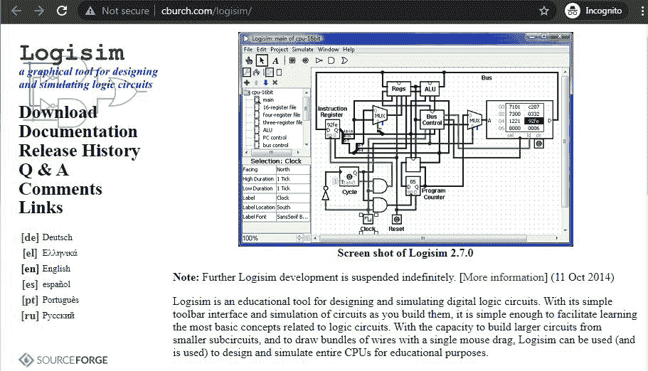
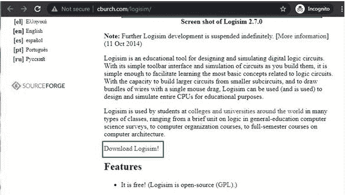
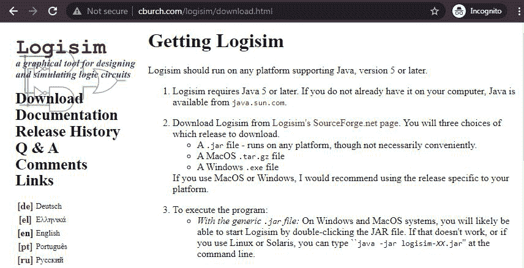
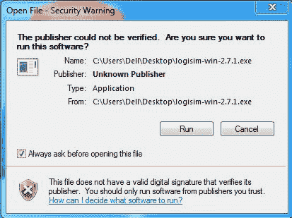
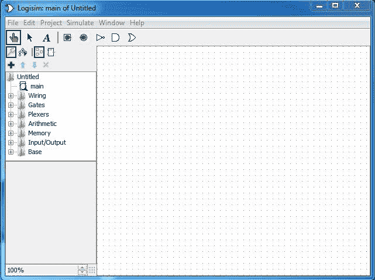

# 如何在 Windows 上安装 Logisim？

> 原文:[https://www . geeksforgeeks . org/如何在 windows 上安装 logisim/](https://www.geeksforgeeks.org/how-to-install-logisim-on-windows/)

**Logisim** 是一个非常强大的工具，用于设计和模拟数字逻辑电路。数字逻辑电路是由不同的逻辑门组成的电子电路，如与门、或门、非门、或非门、与非门等。Logisim 是免费的开源软件，不仅有助于模拟电子电路，而且有能力模拟整个中央处理器。它是一个跨平台的软件。罗吉斯姆是由卡尔·伯奇开发的。不同版本的 logisim 已经发布。windows 的最新版本是 2.7.1

### **罗技的特点:**

1.  它有一个简单易懂的界面，可以轻松使用。
2.  它是一个 Java 应用程序，意味着它可以在任何支持 Java 的平台上运行。
3.  Logisim 支持 Windows、Linux、Mac 等不同的操作系统。

**安装 Logisim 的要求:**

任何系统成功安装 logisim 的主要要求是系统应该能够运行 Java 5 或更高版本。Logisim 可以成功安装在双核、i3、i5 或任何其他最低 ram 为 512 Mb 的处理器以及 Windows XP 之后的任何 Windows 版本的系统上。

## **在 Windows 上安装 logsim:**

按照以下步骤在 Windows 上安装 Logisim:

**第一步:**使用任何网络浏览器访问此[网址](http://www.cburch.com/logisim/)。

**第二步:**在此页面，给出了系统安装 logisim 的所有功能和最低要求。这里给出了 logisim 程序的下载链接。点击下载链接。

**第三步:**点击下载链接后，它将重定向到另一个页面，该页面上有下载 windows、mac 和 a*logsim 的链接。jar* 文件适用于任何平台。点击罗技信的 SourceForge.net 页面链接。

**第 4 步:**点击链接后，页面将被重定向到另一个有 windows logsim 程序的网站。点击下载链接，可执行文件的下载将很快开始。它是最新的 2.7.1 版本。这是一个 6.6 兆的小文件，几乎不需要一分钟。

**第 5 步:**现在在系统的下载中检查可执行文件并运行它。

**第六步:**它会给出一个关于发布者的警告，因为它是开源软件，所以是由社区和主要开发者 Carl Burch 共同贡献的，请忽略这个警告，点击 Run 按钮。

**第七步:**点击 Run 按钮后，logisim 会为系统初始化其界面，并会检查是否支持 Java，只需要几秒钟。

**第 8 步:**软件加载成功，所有工具都可以看到界面。

恭喜你！！此时，您已经在 windows 系统上成功安装了 Logisim。