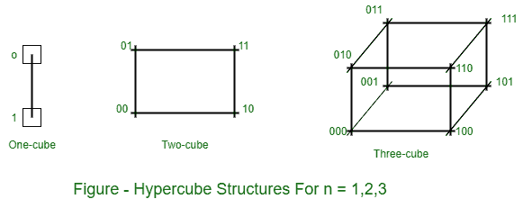

# 超立方体互联

> 原文:[https://www.geeksforgeeks.org/hypercube-interconnection/](https://www.geeksforgeeks.org/hypercube-interconnection/)

**超立方体(或 Binary n-cube 多处理器)**结构表示由 N=2n 个处理器在 N 维二进制立方体中互连而成的松散耦合系统。每个处理器制作一个立方体。每个处理器构成立方体的一个节点。因此，习惯上称每个节点包含一个处理器，实际上它不仅有一个中央处理器，还有本地内存和输入/输出接口。每个处理器都有到 n 个其他相邻处理器的直接通信路径。这些路径对应于立方体的边。

有 2 个不同的 n 位二进制地址可以分配给处理器。每个处理器地址与其 n 个邻居中的每一个的地址相差正好一个比特位置。

*   n= 1，2 和 3 的超立方体结构。
*   一个立方体结构包含 n = 1 和 2n = 2。
*   它有两个处理器通过一条路径互连。
*   双立方体结构包含 n=2 和 2n=4。
*   它有四个相互连接成立方体的节点。
*   n-cube 结构包含 2n 个节点，每个节点中有一个处理器。

每个节点都被分配了一个二进制地址，两个相邻节点的地址正好相差一位。例如，地址为 100 的节点的三个邻居是三个立方体结构中的 000、110 和 101。这些二进制数中的每一个都与地址 100 相差一个比特值。

通过 n-cube 结构路由消息可能需要从源节点到目的节点的一到 n 条链路。

**示例:**
在三立方体结构中，节点 000 可以与 011 通信(从 000 到 010 到 011 或从 000 到 001 到 011)。它应该跨越至少三条链路从节点 000 到节点 111 进行通信。通过确定源节点地址与目的节点地址的异或来设计路由过程。得到的二进制值将有 1 位对应于两个节点不同的轴。然后，消息沿着任一 exe 传输。

例如，节点 010 处去往节点 001 的消息在三立方体结构中产生了等于 011 的两个地址的异或。该消息可以沿着第二轴传输到节点 000，然后通过第三轴传输到节点 001。