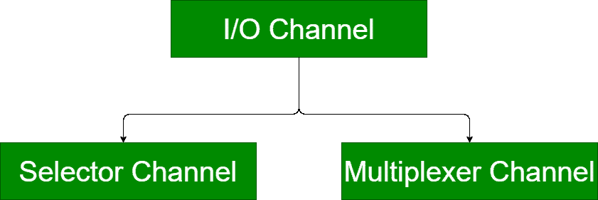
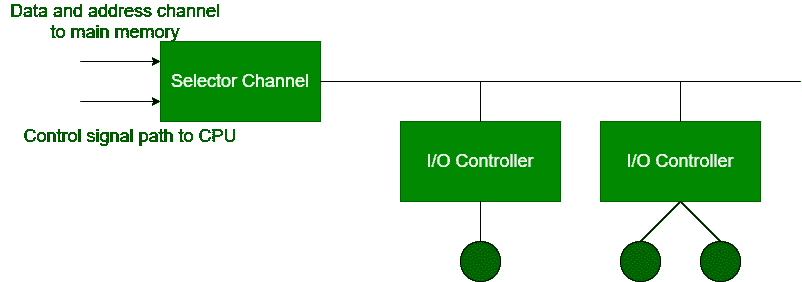
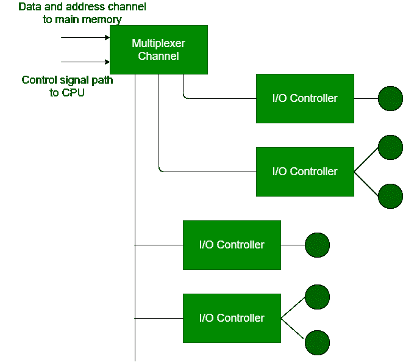

# 输入输出通道及其类型

> 原文:[https://www.geeksforgeeks.org/i-o-channels-and-its-types/](https://www.geeksforgeeks.org/i-o-channels-and-its-types/)

**输入输出通道**是 DMA 概念的延伸。它能够在输入输出通道上使用专用处理器执行输入输出指令，并完全控制输入输出操作。处理器本身不执行输入输出指令。处理器通过指示输入/输出通道在内存中执行程序来启动输入/输出传输。

**程序指定–**一个或多个设备、一个或多个内存区域、优先级和错误条件操作

**输入输出通道类型:**

**1。选择通道:**
选择通道控制多个高速设备。它专门用于与其中一个设备传输数据。在选择器通道中，每个设备都由一个控制器或输入输出模块来处理。它控制图中所示的输入/输出控制器。

**2。多路复用器通道:**
多路复用器通道是一个可以同时处理多个设备的 DMA 控制器。它可以同时对几个设备进行块传输。

该通道使用两种类型的多路复用器:

1.  **字节多路复用器–**
    用于低速设备。它传输或接受字符。交错多个设备的字节。
2.  **块多路复用器–**
    它接受或传输字符块。交错来自几个设备的字节块。用于高速设备。