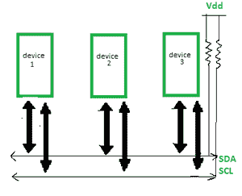
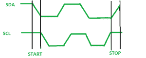

# I2C 通信协议

> 原文:[https://www.geeksforgeeks.org/i2c-communication-protocol/](https://www.geeksforgeeks.org/i2c-communication-protocol/)

I2C 代表**集成电路。**它是一种总线接口连接协议，集成到设备中用于串行通信。它最初是由飞利浦半导体在 1982 年设计的。最近，它是一种广泛用于短距离通信的协议。它也被称为双线接口。

**I2C 通信协议的工作:**
它只使用 2 条双向开漏线进行数据通信，称为 SDA 和 SCL。这两条线都拉高了。

**串行数据(SDA)–**数据传输通过该引脚进行。
**串行时钟(SCL)–**它传送时钟信号。

I2C 以两种模式运行–

*   主模式
*   从属模式

在 SDA 线上传输的每个数据位由 SCL 线上每个时钟的高到低脉冲同步。

根据 I2C 协议，数据线在时钟线为高电平时不能改变，只有在时钟线为低电平时才能改变。这 2 条线路是开漏，因此需要一个上拉电阻，这样线路就为高电平，因为 I2C 总线上的器件为低电平有效。数据以包括 9 位的包的形式传输。这些位的顺序是–

1.  **启动条件**–1 位
2.  **从机地址**–8 位
3.  **确认**–1 位

**启动和停止条件:**

启动和停止可以通过保持 SCL 线高和改变 SDA 的水平来产生。为了产生启动条件，在保持 SCL 高电平的情况下，SDA 从高电平变为低电平。为了产生停止条件，SDA 从低变高，同时保持 SCL 为高，如下图所示。

启动和停止条件

**重复启动条件:**

在每个启动和停止条件对之间，总线被认为是繁忙的，没有主机可以控制总线。如果主机尝试启动新的传输，并且不想在开始新的传输之前释放总线，它会发出新的 START 条件。这被称为重复启动条件。

**读/写位:**

高读/写位表示主机正在向从机发送数据，而低读/写位表示主机正在从机接收数据。

**ACK/NACK 位:**

在每个数据帧之后，跟随一个确认/NACK 位。如果数据帧被成功接收，则接收方向发送方发送确认位。

**寻址:**

地址帧是起始位之后的第一帧。主机想要与之通信的从机地址由主机发送给与之连接的每个从机。然后，从机将自己的地址与该地址进行比较，并发送确认。

**I2C 数据包格式:**

在 I2C 通信协议中，数据以数据包的形式传输。这些包有 9 位长，其中前 8 位放在 SDA 行，第 9 位保留用于确认/NACK，即接收器确认或不确认。

**START 条件**加上**地址包**再加上一个**数据包**加上 **STOP 条件**共同组成一个完整的**数据传输。**

**I2C 通信协议特点:**

*   [**半双工**](https://www.geeksforgeeks.org/difference-between-simplex-half-duplex-and-full-duplex-transmission-modes/) **通信协议–**
    双向通信是可能的，但不能同时进行。
*   [**【同步通信】**](https://www.geeksforgeeks.org/difference-between-synchronous-and-asynchronous-transmission/)**–
    数据以帧或块的形式传输。**
*   **可以在多主机配置中配置。**
*   ****时钟拉伸–**
    当从设备未准备好通过将 SCL 线保持在低电平来接受更多数据时，时钟被拉伸，因此禁用主设备来提升时钟线。主设备将无法提升时钟线，因为线是“与”线，并等待，直到从设备释放 SCL 线，表明它已准备好传输下一位。**
*   ****仲裁**–
    I2C 协议支持多主总线系统，但不能同时使用多条总线。民主行动党和 SCL 党受到主子们的监视。如果 SDA 在本应为低电平时被发现为高电平，则推断另一个主机处于活动状态，因此它会停止数据传输。**
*   **[**串行传输**](https://www.geeksforgeeks.org/difference-between-serial-and-parallel-transmission/)**–**
    I2C 使用串行传输传输数据。**
*   **用于低速通信。**

****优势:****

*   **可以在多主机模式下配置。**
*   **复杂性降低，因为它只使用 2 条双向线路(不同于串行接口通信)。**
*   **性价比高。**
*   **它使用确认/NACK 功能，因此提高了错误处理能力。**

****限制:****

*   **速度慢一点。**
*   **半双工通信用于 I2C 通信协议。**