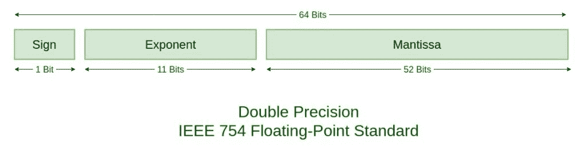

# IEEE 标准 754 浮点数

> 原文:[https://www . geesforgeks . org/IEEE-standard-754-浮点数/](https://www.geeksforgeeks.org/ieee-standard-754-floating-point-numbers/)

IEEE 浮点运算标准(IEEE 754)是由**电气和电子工程师协会(IEEE)** 于 1985 年建立的浮点计算技术标准。该标准解决了各种浮点实现中发现的许多问题，这些问题使它们难以可靠地使用，并降低了它们的可移植性。IEEE 标准 754 浮点是当今计算机上最常见的实数表示，包括基于英特尔的个人电脑、苹果电脑和大多数 Unix 平台。

有几种方法来表示浮点数，但在大多数情况下，IEEE 754 是最有效的。IEEE 754 有 3 个基本组件:

1.  **尾数的符号–**
    这就像名字一样简单。0 代表正数，而 1 代表负数。
2.  **有偏指数–**
    指数字段需要同时表示正指数和负指数。为了得到存储的指数，将偏差加到实际指数上。
3.  **归一化尾数–**
    尾数是科学记数法中数字或浮点数的一部分，由有效数字组成。这里我们只有 2 个数字，即 0 和 1。所以规格化尾数是小数点左边只有一个 1 的尾数。

**IEEE 754 数字基于以上三个分量分为两个:单精度和双精度。**




| 类型 | 符号 | 偏置指数 | 归一化 manisa | BIAS |
| --- | --- | --- | --- | --- |
| 单精度 | 1(第 31 位) | 8(30-23) | 23(22-0) | One hundred and twenty-seven |
| 双倍精密度 | 1(第 63 位) | 11(62-52) | 52(51-0) | One thousand and twenty-three |

**示例–**

```
85.125
85 = 1010101
0.125 = 001
85.125 = 1010101.001
       =1.010101001 x 2^6 
sign = 0 

1\. Single precision:
biased exponent 127+6=133
133 = 10000101
Normalised mantisa = 010101001
we will add 0's to complete the 23 bits

The IEEE 754 Single precision is:
= 0 10000101 01010100100000000000000
This can be written in hexadecimal form 42AA4000

2\. Double precision:
biased exponent 1023+6=1029
1029 = 10000000101
Normalised mantisa = 010101001
we will add 0's to complete the 52 bits

The IEEE 754 Double precision is:
= 0 10000000101 0101010010000000000000000000000000000000000000000000
This can be written in hexadecimal form 4055480000000000 
```

**特殊值:** IEEE 预留了一些会产生歧义的值。

*   **零–**
    零是一个特殊的值，用指数和尾数 0 表示。-0 和+0 是不同的值，尽管它们都相等。
*   **反规格化–**
    如果指数全为零，但尾数不为零，则该值为反规格化数。这意味着这个数字在二进制点之前没有假定的前导 1。
*   **无穷大–**
    值+无穷大和-无穷大用全 1 的指数和全 0 的尾数表示。符号位区分负无穷大和正无穷大。具有无限值的运算在 IEEE 中有很好的定义。
*   **不是数字(NAN)–**
    NAN 值用于表示错误值。当指数字段全是一个零符号位或尾数，而不是 1 后跟零时，就表示了这一点。这是一个特殊的值，可以用来表示还没有值的变量。

| 指数 | 螳螂 | 价值 |
| --- | --- | --- |
| Zero | Zero | 精确 0 |
| Two hundred and fifty-five | Zero |

无穷Zero不是 0反规格化的Two hundred and fifty-five不是 0Not a number (NAN)

类似于双精度(仅用 2049 代替 255)，浮点数的范围:

|  | 反规格化 | 标准化的 | 近似十进制 |
| --- | --- | --- | --- |
| 单精度 | 2 <sup>-149</sup> 至(1–2<sup>-23</sup>)×2<sup>-126</sup> | 2 <sup>-126</sup> 至(2–2<sup>-23</sup>)×2<sup>127</sup> | 大约 10 <sup>-44.85</sup> 到大约 10 <sup>38.53</sup> |
| 双倍精密度 | 2 <sup>-1074</sup> 至(1–2<sup>-52</sup>)×2<sup>-1022</sup> | 2 <sup>-1022</sup> 至(2–2<sup>-52</sup>)×2<sup>1023</sup> | 大约 10 <sup>-323.3</sup> 到大约 10 <sup>308.3</sup> |

正浮点数的范围可以分为规格化数和非规格化数，非规格化数只使用分数的一部分精度。因为每个浮点数都有一个对应的求反值，所以上面的范围是围绕零对称的。

有五个不同的数值范围，单精度浮点数无法用目前给出的方案来表示:

1.  小于–( 2–2<sup>-23</sup>)×2<sup>127</sup>(负溢出)的负数
2.  大于–2 的负数 <sup>-149</sup> (负下溢)
3.  零
4.  小于 2 的正数 <sup>-149</sup> (正下溢)
5.  大于(2–2<sup>-23</sup>)×2<sup>127</sup>(正溢出)的正数

溢出通常意味着值变得太大而无法表示。下溢是一个不太严重的问题，因为它只是表示精度的损失，精度保证接近于零。

有限 IEEE 浮点数的总有效范围表如下所示:

|  | 二进制的 | 小数 |
| --- | --- | --- |
| 单一的 | (2–2<sup>-23</sup>)×2<sup>127</sup> | 大约 10 <sup>38.53</sup> |
| 两倍 | (2–2<sup>-52<sup>)×2<sup>1023</sup></sup></sup> | 约 10 <sup>308.25</sup> |

**特殊操作–**

| 操作 | 结果 |
| --- | --- |
| n ÷无穷大 | Zero |
| 无穷大×无穷大 | 无穷 |
| 非零÷ 0 | 无穷 |
| 有限×无限 | 无穷 |
| 无限+无限
无限–-无限 | +无穷大 |
| -无穷大–无穷大
-无穷大+–无穷大 | –无穷大 |
| ±0 ÷ ±0 | 圆盘烤饼 |
| 无穷大÷无穷大 | 圆盘烤饼 |
| 无穷大× 0 | 圆盘烤饼 |
| NaN == NaN | 错误的 |