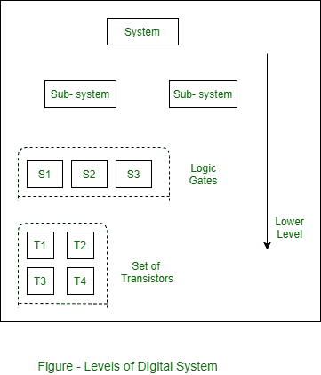

# 数字化系统的实现

> 原文:[https://www . geeksforgeeks . org/实现数字系统/](https://www.geeksforgeeks.org/implementation-of-digital-system/)

先决条件–[数字系统简介](https://www.geeksforgeeks.org/introduction-to-digital-systems/)
实现意味着系统是如何由称为模块的更小更简单的组件构建而成的。模块可以从简单的盖茨到复杂的处理器。数字系统遵循一些分层实现。

**分层实现:**
它是一个模块化设计系统，采用分治技术，简化了实现和调试。模块分别设计和构建，然后组装形成系统。数字系统成本效益的主要因素之一。

**自上而下的设计:**
它从顶部(根)开始，通过连续的细化向下工作。这种设计将系统分解成子系统，再将子系统分解成更简单、更小的子系统等等。当子系统可以直接通过模块实现时停止。

**自下而上的设计:**
它从叶子开始，将碎片放在一起形成设计。子系统被组装成一个更大的子系统。当达到要求的功能规格时，它停止。

在实践中，自上而下和自下而上的设计方法都是需要和使用的。设计师需要一种自上而下的方法来划分和征服，以处理复杂性，设计师需要自下而上的方法，因为在一个设计良好的系统中，结构的设计受到可用原语的影响。