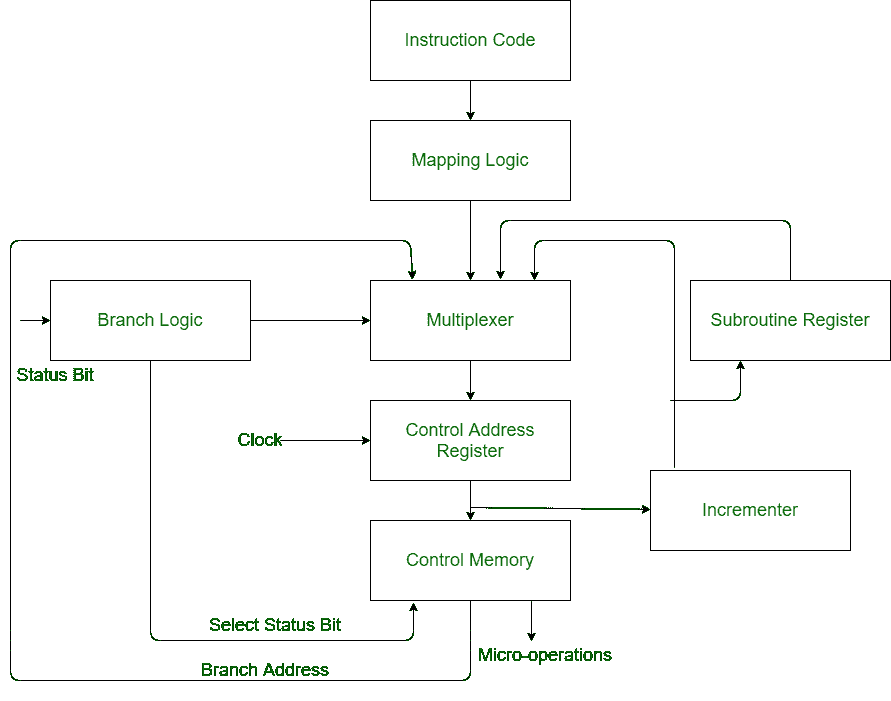

# 微指令序列器的实现

> 原文:[https://www . geesforgeks . org/实现-微指令-定序器/](https://www.geeksforgeeks.org/implementation-of-micro-instructions-sequencer/)

**微指令序列器**是选择下一个微指令地址的所有硬件的组合。控制存储器中的微指令包含一组启动计算机寄存器微操作的位和指定获取地址方法的其他位。

**微指令序列器的实现–**

*   **控制地址寄存器(CAR) :**
    控制地址寄存器接收来自四个不同路径的地址。为了从四个不同的路径接收地址，使用了多路复用器。

*   **Multiplexer :**
    Multiplexer is a combinational circuit which contains many data inputs and single data output depending on control or select inputs.*   **Branching :**
    Branching is achieved by specifying the branch address in one of the fields of the micro instruction. Conditional branching is obtained by using part of the micro-instruction to select a specific status bit in order to determine its condition.*   **Mapping Logic :**
    An external address is transferred into control memory via a mapping logic circuit.*   **Incrementer :**
    Incrementer increments the content of the control address register by one, to select the next micro-instruction in sequence.*   **Subroutine Register (SBR) :**
    The return address for a subroutine is stored in a special register called Subroutine Register whose value is then used when the micro-program wishes to return from the subroutine.*   **控制存储器:**
    控制存储器是一种包含可寻址存储寄存器的存储器。数据暂时存储在控制存储器中。控制存储器可以比主存储器更快地被访问。