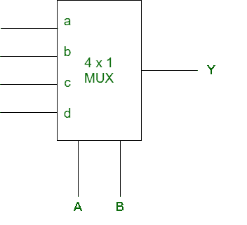
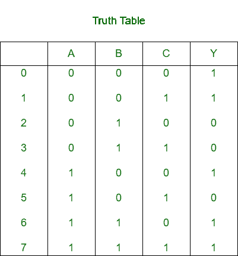
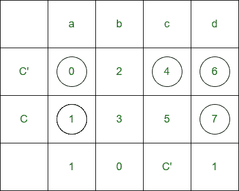
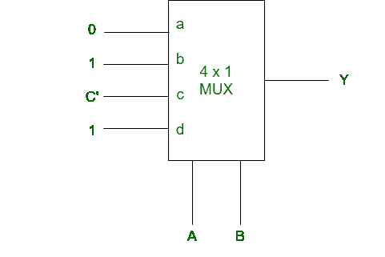

# 使用多路复用器实现 SOP 功能

> 原文:[https://www . geeksforgeeks . org/实现-sop-函数-使用-复用器/](https://www.geeksforgeeks.org/implementation-of-sop-function-using-multiplexer/)

给定一个标准操作程序功能和一个[多路复用器](https://www.geeksforgeeks.org/multiplexers-in-digital-logic/)。我们需要使用给定的多路复用器实现给定的标准操作程序功能。

其中涉及到某些步骤:
**步骤 1:** 为给定数量的变量函数绘制真值表。
**步骤 2:** 考虑一个变量作为输入，其余变量作为选择线。
**步骤 3:** 形成矩阵，其中多路复用器的输入行是列，输入变量及其补码是行。
**第四步:**根据真值表找出两行之间的 AND。
**步骤 5:** 因此，无论发现什么都被视为多路复用器的输入。

我们将用一个例子来说明:

**示例:**
给定 SOP 函数 f(A，B，C) = m(0，1，4，6，7)，MUX 为

对于 3 变量函数，真值表为

假设 A 和 B 是选择线，C 是输入，

因此，为了实现给定的逻辑功能，需要一个 4×1 多路复用器和一个反相器。

