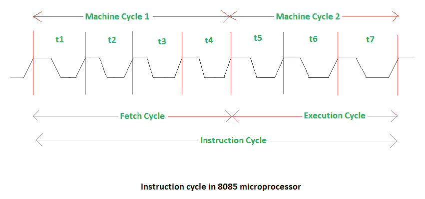
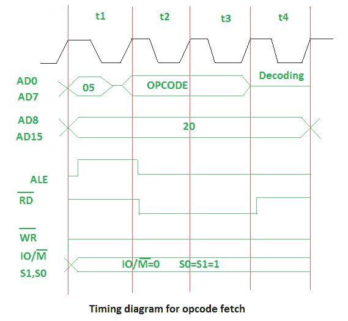

# 8085 微处理器中的指令周期

> 原文:[https://www . geesforgeks . org/指令-周期-8085-微处理器/](https://www.geeksforgeeks.org/instruction-cycle-8085-microprocessor/)

执行和获取整个指令所需的时间称为*指令周期*。它包括:

*   **取指令周期–**下一条指令由存储在程序计数器(PC)中的地址取出，然后存储在指令寄存器中。
*   **解码指令–**解码器解释指令寄存器中的编码指令。
*   **读取有效地址–**从主存储器中读取指令中给出的地址，并提取所需数据。有效地址取决于直接寻址模式或间接寻址模式。
*   **执行周期–**由内存读取(MR)、内存写入(MW)、输入输出读取(IOR)和输入输出写入(IOW)组成

微处理器完成访问存储器或输入/输出设备的操作所需的时间称为*机器周期*。微处理器频率的一个时间段称为 *t 状态*。t 状态是从一个时钟脉冲的下降沿到下一个时钟脉冲的下降沿测量的。
提取周期需要四个 t 状态，执行周期需要三个 t 状态。

获取周期或操作码获取的时序图:

上图表示:

*   **05–**操作码存储地址的低位。使用多路复用的地址和数据总线 AD0-AD7。
*   **20–**操作码存储地址的高位。使用多路复用地址和数据总线 AD8-AD15。
*   **ALE–**为多路复用的地址和数据总线提供信号。如果信号为高电平或 1，多路复用的地址和数据总线将用作地址总线。要获取地址的低位，信号为 1，以便多路复用总线可以充当地址总线。如果信号为低电平或 0，多路复用总线将用作数据总线。当取地址的低位时，由于信号为低电平，它将作为数据总线。
*   **RD(低电平有效)–**如果信号为高电平或 1，微处理器不会读取任何数据。如果信号为低电平或 0，数据由微处理器读取。
*   **WR(低电平有效)–**如果信号为高电平或 1，微处理器不会写入任何数据。如果信号为低电平或 0，数据由微处理器写入。
*   **IO/M(低电平有效)和 S1，S0–**如果信号为高电平或 1，操作正在输入输出上执行。如果信号为低电平或 0，则存储器正在执行操作。

