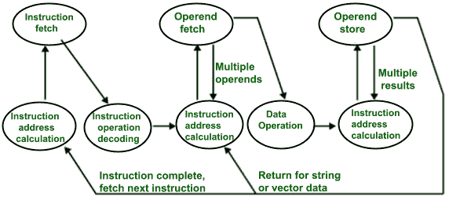
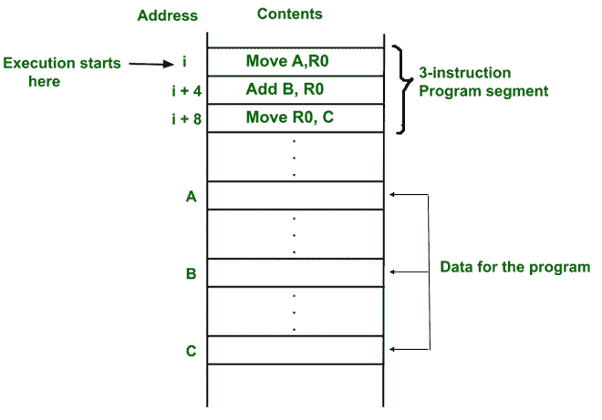
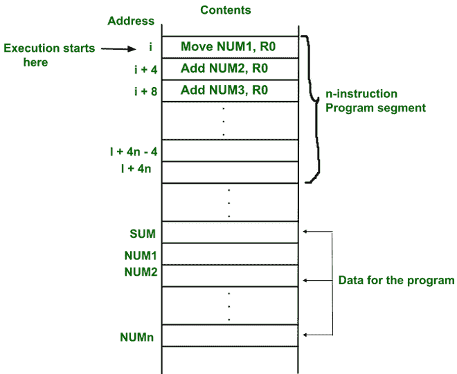
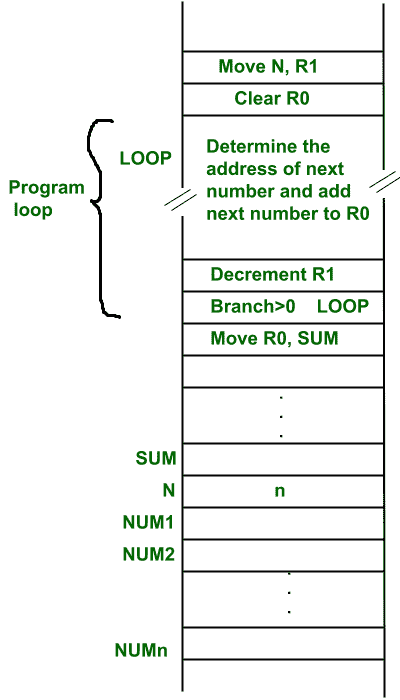

# CO 中的指令执行和直线排序

> 原文:[https://www . geesforgeks . org/指令-执行-和-直线-定序-in-co/](https://www.geeksforgeeks.org/instruction-execution-and-straight-line-sequencing-in-co/)

**简介:**
由于指令是存储在内存中的程序的一部分，所以每当处理器需要执行一条指令时，为此处理器首先从内存中取出指令，然后解码该指令，然后执行该指令。整个过程被称为指令周期。

**指令周期状态转换图**

**指令执行:**
指令执行需要以下步骤，分别是

*   处理器的程序计数器寄存器给出了需要从存储器中取出的指令的地址。
*   如果指令被提取，指令操作码被解码。解码时，处理器识别操作数的数量。如果有任何要从内存中提取的操作数，则计算该操作数地址。
*   从内存中提取操作数。如果有一个以上的操作数，则可以重复操作数提取过程(即地址计算和提取操作数)。
*   之后，对操作数执行数据操作，并生成结果。
*   如果结果必须存储在寄存器中，指令到此结束。
*   如果目的地是内存，那么首先需要计算目的地地址。然后将结果存储在存储器中。如果有多个结果需要存储在存储器中，则该过程可以重复(即，目的地地址计算和存储结果)。
*   现在当前的指令已经执行。并行地，PC 递增以计算下一条指令的地址。
*   然后，重复上述指令周期以获得进一步的指令。

**直线排序:**

*   直线排序是指程序的指令以顺序方式执行(即每次 PC 增加一个固定的偏移量)。
*   电脑上没有加载分支地址。

**示例–**

*   这里，程序和数据存储在同一个内存中，即冯·诺依曼架构。
*   程序的第一条指令存储在地址 I。PC 给出地址 I，存储在该地址 I 的指令从存储器中取出并解码，然后从存储器中取出操作数 A 并存储在临时寄存器中，然后执行该指令(即地址 A 的内容被复制到处理器寄存器 R0 中)。
*   在解码或执行过程中，由于指令和存储段是 4 字节的，所以并行地，个人计算机递增 4(即它包含下一条指令的地址)。所以地址 I 的指令被执行。
*   所以每次，电脑都会加 4。因此，程序是以顺序方式执行的。这个过程叫做直线排序。

**例 2–**
用于添加 n 个数字的直线排序程序。

*   包含 n 个数字的存储单元的地址表示为 NUM1，NUM2…..NUMn(即 NUM1 地址包括第一个号码)。
*   第一个数字存储在处理器寄存器 R0 中。每隔一个数字加到寄存器 R0。最后，当程序结束时(即 n 个数字相加)，结果被放入内存位置 SUM

**n 个数相加的直线排序程序**

*   第二种方法是用一个循环加 n 个数。但是这里不使用直线排序，因为每次循环迭代结束时，PC 必须加载分支地址，程序从该地址开始执行。
*   这里，位置 N 存储 N 的值。处理器寄存器 R1 用作计数器，以确定循环被执行的次数。
*   在程序执行开始时，位置 N 的内容被移动到 R1。
*   之后，寄存器 R0 被清零。
*   地址循环被一次又一次地重新加载，直到 R1 变成 0(这意味着所有的数字都被加上)。每次添加一个数字，R1 值就会递减。
*   当 R1 为 0 时，我们退出循环，存储在 R1 的结果被复制到内存位置 SUM。

