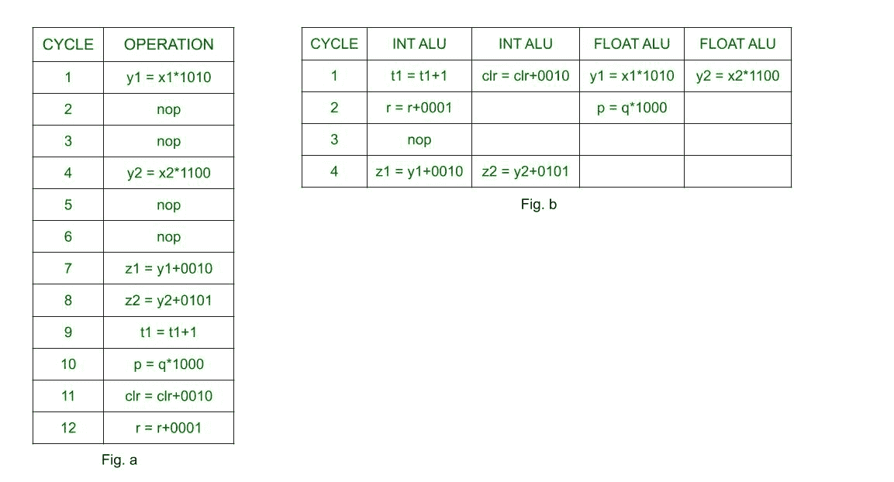

# 指令级并行度

> 原文:[https://www . geesforgeks . org/指令级-并行/](https://www.geeksforgeeks.org/instruction-level-parallelism/)

**先决条件–**[并行计算入门](https://www.geeksforgeeks.org/introduction-to-parallel-computing/)

**指令级并行(ILP)** 是指在一个特定的进程中可以并行执行多个操作的架构，有自己的一组资源——地址空间、寄存器、标识符、状态、程序计数器。它指的是编译器设计技术和处理器，旨在并行执行操作，如内存加载和存储、整数加法、浮点乘法，以提高处理器的性能。利用 ILP 的体系结构的例子是超长指令字，超标量体系结构。

ILP 处理器的执行硬件与 [RISC 处理器](https://www.geeksforgeeks.org/computer-organization-risc-and-cisc/)相同。没有 ILP 的机器硬件复杂，难以实现。典型的 ILP 允许多周期操作流水线化。

**例:**
假设在一个时钟周期内可以进行 4 次运算。因此，在 ILP 执行硬件中，将有 4 个功能单元，每个功能单元连接到操作、分支单元和公共寄存器文件中的一个。功能单元可以执行的子操作是整数算术逻辑单元、整数乘法、浮点运算、加载、存储。让各自的延迟时间为 1，2，3，2，1。

让指令的顺序为–

1.  y1 = x1*1010
2.  y2 = x2*1100
3.  z1 = y1+0010
4.  z2 = y2+0101
5.  t1 = t1+1
6.  p = q*1000
7.  clr = clr+0010
8.  r = r+0001

**顺序执行记录与指令级并行执行记录–**

图 a 示出了操作的顺序执行。
图 b 显示了 ILP 在提高处理器性能方面的应用。

上图中的“nop”或“no operations”用于显示处理器的空闲时间。由于浮点运算的延迟为 3，因此乘法需要 3 个周期，并且处理器必须在这段时间内保持空闲。然而，在图 b 中，处理器可以利用那些 nop 来执行其他操作，而先前的操作仍在执行。

而在顺序执行中，每个周期只有一个操作被执行，在带有 ILP 的处理器中，周期 1 有 4 个操作，周期 2 有 2 个操作。在周期 3 中，存在“nop”，因为接下来的两个运算依赖于前两个乘法运算。顺序处理器需要 12 个周期来执行 8 个操作，而带有 ILP 的处理器只需要 4 个周期。

**架构:**
当在单个周期中执行多个操作时，通过同时执行它们或利用由于延迟而产生的两个连续操作之间的间隙来实现指令级并行。

现在，何时执行操作的决定很大程度上取决于编译器，而不是硬件。然而，编译器的控制范围取决于 ILP 体系结构的类型，其中编译器通过程序提供给硬件的关于并行性的信息各不相同。ILP 体系结构的分类可以通过以下方式完成–

1.  **顺序体系结构:**
    在这里，程序不像超标量体系结构那样被期望向硬件明确传达任何关于并行性的信息。
2.  **依赖架构:**
    这里，程序明确提到了关于操作之间依赖关系的信息，比如数据流架构。
3.  **独立架构:**
    这里，程序给出了关于哪些操作相互独立的信息，以便它们可以代替‘nop’来执行。

为了应用 ILP，编译器和硬件必须确定数据依赖性、独立操作以及这些独立操作的调度、功能单元的分配和存储数据的寄存器。