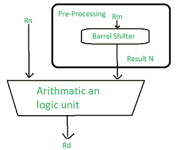

# 微控制器的指令集

> 原文:[https://www . geesforgeks . org/微控制器指令集/](https://www.geeksforgeeks.org/instruction-sets-of-a-microcontroller/)

**数据处理指令:**
我们使用数据处理指令来操作寄存器内的数据。

数据处理说明的类型–

*   算术指令
*   逻辑指令
*   乘法指令
*   比较说明
*   移动指令

大多数数据处理指令使用一个 barre 移位器来预处理其中一个操作数的数据。每个操作都会更新 cpsr 中的不同标志(了解更多关于“CPSR”搜索“ARM 中的 CPSR”的信息)。

让我们详细讨论一下说明。

**1。算术指令:**
算术指令主要实现 32 位有符号和无符号值的加减运算。

语法: <instruction>{ <cond>}{s} Rd，Rn，N</cond></instruction>

<figure class="table">

| 物理输出核心 | 用 32 位值相加并进位 | rd = Rn+N+进位 |
| 注意缺陷障碍 (Attention Deficit Disorder) | 添加两个 32 位值 | Rd=Rn+N |
| RSB | 反向减去两个 32 位值 | Rd=N-Rn |
| 皇家莎士比亚剧团(Royal Shakespeare Company) | 带两个 32 位值进位的反向减法 | Rd=N-Rn-！(携带旗帜) |
| 小企业委员会(Small Business Council)ˌ单板计算机(single board computer)ˌ瑞士银行公司(Swiss Bank Corp.) | 两个 32 位值的进位减法 | Rd=Rn-N-！(携带旗帜) |
| 潜水艇 | 减去两个 322 位值 | Rd=Rn-N |

<figure class="table">

| n 是换档操作的结果。 |

</figure>

**示例–**
1**。**这个简单的减法指令从寄存器 r1 中存储的值中减去寄存器 r2 中存储的值。结果存储在寄存器 r0 中

**PRE**
**r0 = 0x 00000000；由于该寄存器是保存输出的寄存器，所以执行前为空
R1 = 0x 000000002；寄存器 r1 保存值‘2’
R2 = 0x 00000001；r2 持有另一个值‘1’
SUB r0，r1，R2；r0 = R1–R2。在此，执行运算后，减去的值(r0–R1)被移动到 r0。**

****POST**
r0 = 0x 00000001；这是移动到 r0 寄存器的上述指令的输出**

**2.这个反向减法指令(RSB)从常数值#0 中减去 r1，将结果写入 r0。
反向减法对整数值有帮助，这样就可以不复杂地减去指令。**

****PRE**
**r0 = 0x 00000000；输出寄存器
R1 = 0x 00000077；要反向减去的值
RSB r0，r1，# 0；rd = 0x-–R1****

******POST**
**r0 =-R1 = 0x ffffff89；产生反向输出并存储在寄存器 r0 中******

********桶形移位器与算术指令的使用–**
桶形移位器是 ARM 指令集的强大功能之一。
在对其中一个操作数/寄存器执行操作之前，对其进行预处理。******

******示例–******

******pre**
**【r0 = 0x 00000000
【r1 = 0x 00000005】
add r0，r1，R1，LSL #1******

********POST**
**r0 = 0x 0000000 f
R1 = 0x 00000005********

********2。逻辑指令–**
逻辑指令对两个源寄存器执行按位逻辑运算。
语法:<指令> { <秒> } {S} Rd，Rn，N******

<figure class="table">

| 和 | 两个 32 位值的逻辑按位“与” | Rd = Rn & N |
| 整体反应率（TheOverallResponseRate） | 两个 32 位值的逻辑按位“或” | Rd = Rn &#124; N |
| 提高石油采收率 | 两个 32 位值的逻辑异或 | Rd = Rn ^ N |
| BIC | 逻辑位清零(与非) | Rd = Rn &~ N |

******例–**
1。本例显示了寄存器 r1 和 r2 之间的逻辑或运算，r0 保存结果。****

******pre**
**【r0 = 0x 00000000】
【r1 = 0x 0204008
【r2 = 0x 10305070】
orr r0，R1，R2******

********POST**
**r0 = 0x 12345678********

******2.这个例子展示了一个更复杂的逻辑指令，叫做 BIC，它执行一个逻辑位清零。******

******pre**
**【r1 = 0b 1111
【r2 = 0b 0101】
BIC r0，R1，R2******

********POST**T2【r0 = 0b 1010】******

******3。乘法指令–**
乘法指令根据指令将一对寄存器的内容相乘，并将结果与另一个寄存器累加。长乘法累加到一对代表 64 位值的寄存器上。最终结果放在目标寄存器或寄存器对上。****

******语法–**MLA {<cond>} { S } Rd，Rm，Rs，Rn
MUL{ < cond > }{S} Rd，Rm，Rs****

<figure class="table">

| 现代语言协会 | 乘法和累加 | Rd = (Rm * Rs) + Rn |
| MUL | 多样地 | Rd = Rm * Rs |

******语法─**<指令><伯爵>} { rdlo】、RdHi、Rm、Rs****

<figure class="table">

| 小的 | 有符号乘法长累加 | [RdHi，RdLo] = [RdHi，RdLo] + (Rm * Rs) |
| 小的 | 有符号乘法长 | 【RdHi，rdlo】= RM * RS |
| UMLAL | 无符号乘法长时间累加 | [RdHi，RdLo] = [RdHi，RdLo] + (Rm * Rs) |
| UMULL | 无符号长乘 | 【RdHi，rdlo】= RM * RS |

****处理器实现处理执行乘法指令所需的周期数。****

******示例 1–******

*   ****此示例表示简单的乘法指令，将寄存器 r1 和 r2 相乘，并将结果放入寄存器 r0。****
*   ****寄存器 r1 等于值 2，r2 等于 2，然后被替换为 r0。****

******PRE**
r0 = 0x 00000000；寄存器保存输出
R1 = 0x 00000002；保存操作数 1 值的寄存器
R2 = 0x 00000002；保存操作数 2 值
MUL r0、r1、r2 的寄存器；r0 = r1 * r2****

******POST**
r0 = 0x 00000004；乘法运算的输出
R1 = 0x 00000002
R2 = 0x 00000002；操作数****

******示例 2–******

******pre**
【r0 = 0x 00000000】
r1 = 0x 00000000
r2 = 0x 0000002
R3 = 0x 00000002
UML r0，R1，R2，R3；[r1，r0] = r2 * r3****

******邮政**
r0 = 0x 0000004；= rdlo
R1 = 0x 00000001；= RdHi****

******4。比较指令–**
这些指令用于比较或测试具有 32 位值的寄存器。它们根据结果更新 cpsr 标志位，但不影响其他寄存器。在这些位被置位之后，这些信息就可以通过使用条件执行来改变程序流程。****

******语法–**<指令> { <秒>Rn，N****

<figure class="table">

| CMN | 比较被否定 | 由于 Rn + N 而设置的标志 |
| 金属波纹管(Corrugated Metal Pipe) | 比较 | 由于 Rn–N 而设置的标志 |
| TEQ | 测试两个 32 位值的质量 | 由于 Rn ^ N 而设置的标志 |
| 测验(test) | 32 位值的测试位 | 由于注册和注册而设置的标志 |

<figure class="table">

| n 是移位器操作的结果。 |

</figure>

******示例–******

******PRE**T2】cpsr = nzcvqift _ USER
r0 = 4；待比较寄存器
r9 = 4；待比较寄存器
CMP r0、r9****

******POST**T2【cpsr = nzcvqift _ USER】比较后生成的输出****

******5。移动指令–**
移动是最简单的 ARM 指令。它将 N 复制到目的寄存器 Rd 中，其中 N 是寄存器或立即值。该指令对于设置初始值和在寄存器之间传输数据非常有用。****

******语法–**<指令> { <秒> }{S} Rd，N****

<figure class="table">

| MOV | 将 32 位值移入寄存器 | Rd = N |
| MVN | 将 32 位值的非移入寄存器 | Rd = ~N |

******例–**
**PRE**
r5 = 5；寄存器值
r7 = 8；寄存器值
MOV r7、r5；让 r7 = r5****

******POST**
r5 = 5；将 r5 数据移入 r7 后寄存器中的数据
r7 = 5；移动操作后的输出****

******桶形移位器–**
它是一个移动可变数量单词的装置。它是一种逻辑器件，用于在对算术逻辑单元操作进行操作之前预处理一个操作数/寄存器。这是 ARM 最好的特性之一。****

****

桶形移位**** 

<figure class="table">

| **助记符** | **描述** | **换挡** | **结果** | **换挡量** |
| 链路支持层 | 逻辑左移 | xLSLy | x< | #0-31 或 Rs |
| LSR | 逻辑右移 | xLSRy | (无符号)x>>y | #1-32 或 Rs |
| 自动语音识别(Automatic Speech Recognition) | 算术右移 | xASRy | x>>y(签名) | #1-32 或 Rs |
| ROR | 右旋 90 度 | xRORy | ((无符号)x > > y)&#124;(x < | #1-31 或 Rs |
| RRX | 向右延伸旋转 | xRRX | (c 标志〔t0〕1) | 没有人 |

</figure>

<figure class="table">

| x 代表被移位的寄存器，y 代表移位量 |

</figure>

<figure class="table">

| **N 档操作** | **语法** |
| 马上 | #立即 |
| 注册 | 空间 |
| 即时逻辑左移 | Rm，LSL #shift_imm |
| 寄存器向左逻辑移位 | Rm，LSL Rs(核磁共振成像) |
| 立即逻辑右移 | Rm，LSR #shift_imm |
| 寄存器逻辑右移 | Rm，LSR Rs(核磁共振成像) |
| 算术立即右移 | Rm，ASR #shift_imm |
| 寄存器向右算术移位 | Rm、ASR Rs |
| 立即向右旋转 | Rm，error # shift _ IMM |
| 通过寄存器向右旋转 | Rm、error RS |
| 随着延伸向右旋转 | Rm、RRX |

</figure>

******示例**–****

*   ****这个 MOVS 指令的例子将寄存器 r1 左移一位。****
*   ****这会将寄存器 r1 乘以值 2 1****

******pre**
【cpsr = nzcvqift _ user】
r0 = 0x 00000000
【r1 = 0x 800000004
**movs r0，R1，LSL #1******

******POST**T2】cpsr = nzCvqiFt _ USER
r0 = 0x 0000008
R1 = 0x 80000004****

*   ****在 CPSR 更新 C 标志，因为 S 后缀出现在指令助记符中。****

</figure>

</figure>

</figure>

</figure>

</figure>

</figure>