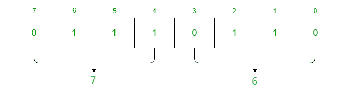

# 【8254 PIT 与 8085 微处理器的接口

> 原文:[https://www . geesforgeks . org/interface-8254-pit-with-8085-微处理器/](https://www.geeksforgeeks.org/interface-8254-pit-with-8085-microprocessor/)

先决条件–[8254 控制寄存器和操作模式](https://www.geeksforgeeks.org/8254-control-word-operating-modes/)
**问题–**在 8085 微处理器中编写一个汇编语言程序，如果 8254 的时钟频率为 2 兆赫，该程序通过使用计数器 1 作为二进制计数器来产生 1 千赫方波。

**假设–**假设 C0(计数器 0)、C1(计数器 1)、C2(计数器 2)、控制寄存器的端口地址为 80 H、81 H、82 H、83 H。

对于上述问题，8254 必须工作在模式 3，即方波发生器。
寄存器的计数为时钟频率/方波频率
计数= 2 兆赫/ 1 千赫
= 2000
= (07D0) H
现在数据为 16 位，因此控制寄存器中 RW1 = 1 和 RW0 = 1 的值。当我们想要选择 C1(计数器 1)时，控制寄存器中 SC1 = 0 和 SC0 = 1 的值。控制寄存器中模式 3 的 M2 值= 0，M1 值= 1，M2 值= 1。对于二进制计数器，CR 中 LSB 的值为 0。

因此，控制寄存器由下式给出:

**算法–**

1.  将数据 76 移入
2.  显示端口 83 的内容
3.  在 A 中移动数据 D0
4.  显示端口 81 的内容
5.  将数据 07 移入
6.  显示端口 81 的内容
7.  停止

**程序–**

| 存储地址 | 记忆术 | 评论 |
| --- | --- | --- |
| Two thousand | MVI A 76 | A |
| Two thousand and two | 输出 83 | CR |
| Two thousand and four | MVI 至 D0 | A | Two thousand and six | 输出 81 | C1 | Two thousand and eight | MVI A 07 | A | 200A | 输出 81 | C1 | 200 摄氏度 | HLT | 停止 |

**解释–**

1.  **MVI A 76** 用于将 CR(控制寄存器)的内容移动到寄存器 A
2.  **OUT 83** 用于将 A 的值分配给端口 83，即控制寄存器。
3.  **MVI A D0** 用于将计数器 1 数据的低位字节移到寄存器 A
4.  **OUT 81** 用于将 A 的值分配给端口 81，即计数器 1。
5.  **MVI A 07** 用于将计数器 1 的高字节数据移至寄存器 A
6.  **OUT 81** 用于将 A 的值分配给端口 81，即计数器 1。
7.  **HLT** 用于结束程序。