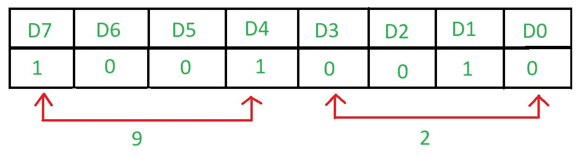

# 【8255 与 8085 微处理器接口添加

> 原文:[https://www . geesforgeks . org/interface-8255-8085-微处理器-加法/](https://www.geeksforgeeks.org/interface-8255-8085-microprocessor-addition/)

**问题–**将 8255 与 8085 微处理器接口，编写一个确定 A 口和 B 口内容相加的汇编程序，并将结果存入 c 口。

**示例–**




**算法–**

1.  构造控制字寄存器
2.  从端口 A 和端口 B 输入数据
3.  添加端口 A 和端口 B 的内容
4.  在端口 C 显示结果

**程序–**

| 记忆术 | 评论 |
| --- | --- |
| MVI A， 90 | A ← 92 |
| 输出 83 | 控制寄存器← A |
| 80 年 | A←A 口； |
| 莫夫 b，a | b←A； |
| 81 年 | a←B 口； |
| 添加 B | A←A+B； | 输出 82 | 端口 C ← A |
| 浸水使柔软 | 返回 |

**解释–**

1.  **MVI A，92** 表示控制寄存器的值为 92。

    ```
    D7=1 as it is in I/O mode.
    D6=0 & D5=0 as Poet A is in m0 mode.
    D4=1 as Port A is taking input.
    D3=0 & D0=0 as Port C is not taking part.
    D2=0 as mode of Port B is m0.
    D1=1as Port B is taking the input.
    ```

2.  **OUT 83** 将 A 的值放入端口控制寄存器的端口号 83H。
3.  **IN 80** 从端口 a 的端口号 80H 取输入
4.  **MOV B、A** 将 A 寄存器的内容复制到 B 寄存器。
5.  **在 81** 中，输入端口 b 的端口号 feom 81H。
6.  **添加 B** 添加 A 寄存器和 B 寄存器的内容。
7.  **输出 82** 在 81H 中显示结果，81H 是端口 C 的端口号
8.  **RET** 返回