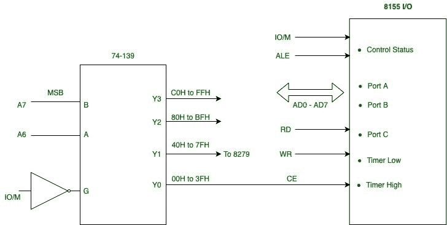
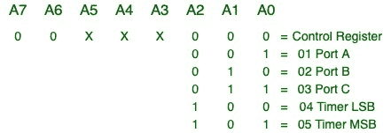

# 用多个地址连接 8155 输入/输出端口和 8279】

> 原文:[https://www . geesforgeks . org/interfacing-8155-I-o-port-and-8279-带多个地址/](https://www.geeksforgeeks.org/interfacing-8155-i-o-ports-and-8279-with-multiple-addresses/)

本文讲述的是一种使用 2 对 4 解码器 **74139** 的解码技术。
上述设备内部有两个 2-4 解码器，一个用于接口输入输出端口，另一个用于接口存储器。

让我们看看输入/输出接口:

1.  解码器的输入是地址线 A7 和 A6。
2.  解码器通过反相器由输入输出信号使能。
3.  每当处理器断言输入输出为高电平以访问输入输出端口时，解码器就会变为活动状态。
4.  地址线 A5-A0 在本示意图中未解码，其中一些连接到可编程输入/输出设备，如 *8155* 和 *8279*

这个图看起来像这样:

**Figure –** Interfacing 8155 I/O ports and 8279

**8155 输入/输出地址:**

**Figure –** 8155 I/O Addresses

**8279 输入/输出地址:**

**Figure –** 8279 I/O Addresses

**多个输入输出地址:**

*8279* 只需要两个地址，但是因为五个不在意线，占用了 64 个 I/O 地址的空间。在 *8155* 的情况下，三个地址行无关紧要；因此，它的输入/输出端口和定时器有八组地址范围。

**优势:**

1.  节约成本
2.  节省空间