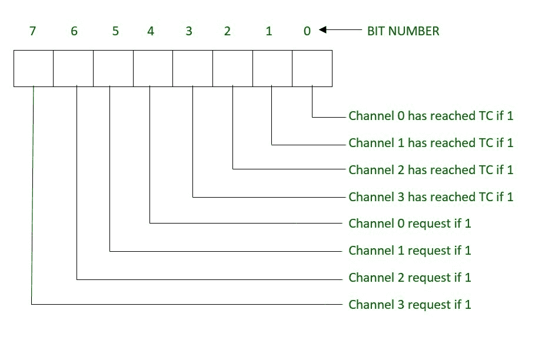
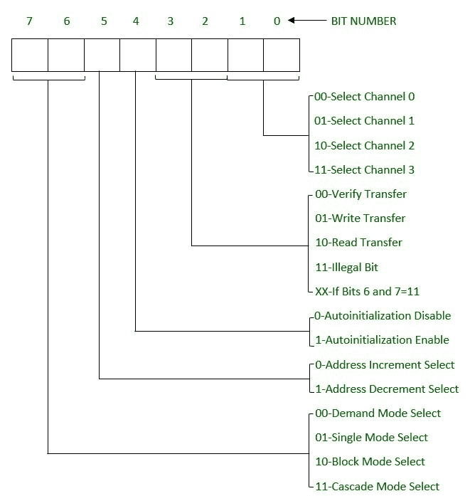
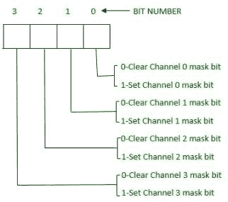
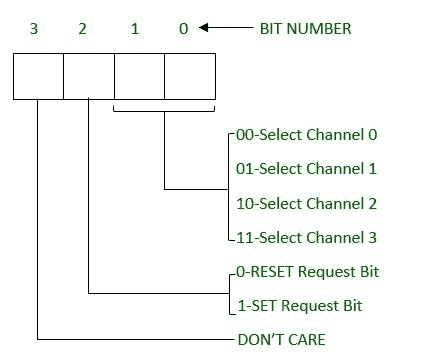

# DMA 控制器的内部寄存器

> 原文:[https://www . geesforgeks . org/内部寄存器 dma 控制器/](https://www.geeksforgeeks.org/internal-registers-of-dma-controller/)

[直接存储器存取(DMA)](https://practice.geeksforgeeks.org/problems/direct-memory-access-dma) 控制器的内部寄存器如下

```
1. Base Address Register (16 bit)
2. Base Word Count Register (16 bit)
3. Current Address Register (16 bit)
4. Current Word Count Register (16 bit)
5. Temporary Address Register (16 bit)
6. Temporary Word Count Register (16 bit)
7. Status Register (8 bit)
8. Command Register (8 bit)
9. Temporary Register (8 bit)
10. Mode Register (8 bit)
11. Mask Register (4 bit)
12. Request Register (4 bit) 
```

这些解释如下。

1.  **基址寄存器:**
    这是一个 16 位寄存器，存储 DMA 控制器中数据传输的起始地址。它用于在每次操作后重新加载当前地址寄存器。
2.  **基本字计数寄存器:**
    它是一个 16 位寄存器，存储操作期间要执行的传输次数。它用于在每次操作后重新加载当前字数统计寄存器。

*   **当前地址寄存器:**
    这是一个 16 位寄存器，存储 DMA 数据传输的内存地址。每次操作后，该值会根据编程方式自动增加或减少。每个通道都有自己的当前地址寄存器。*   **当前字数寄存器:**
    这是一个 16 位寄存器，存储操作期间剩余的传输次数。每次操作后，该值会自动降低。*   **临时地址寄存器:**
    它是一个 16 位寄存器，在 DMA 控制器中存储内存到内存传输期间的数据地址。*   **临时字数寄存器:**
    这是一个 16 位寄存器，用于存储在直接存储器存取控制器中内存到内存传输期间要执行的传输次数。*   **Status Register:**
    It is a 8 bit register that indicates which channel is currently under DMA services or which channels has reached its terminal count. It basically gives the status of the channels. The terminal counts(TC) bits indicates if the channel has reached its terminal count. If terminal count is reached, the transfers are terminated.

    

    *   **命令寄存器:**
    这是一个 8 位寄存器，用于对 DMA 操作进行编程，并初始化用于数据传输的通道。*   **临时寄存器:**
    它是一个 8 位寄存器，在内存到内存的数据传输过程中保存数据。它总是包含在前一个内存到内存传输操作中传输的最后一个字节。*   **Mode Register:**
    It is a 8 bit register that determines the operating mode, i.e., the transfer mode and other transfer parameters, for a channel. Each channel has its own mode register which is selected by bit positions 0 and 1.

    

    *   **Mask Register:**
    It is a 4 bit register that is used to mask a channel from requesting the DMA Services. When the mask on a channel is SET, the channel is disabled. It sets or clears all the mask on all the channels with just one command.

    

    *   **Request Register:**
    It is a 4 bit register that is used to request DMA data transfer by the software. It determines which channel is requesting for the data transfer.

    