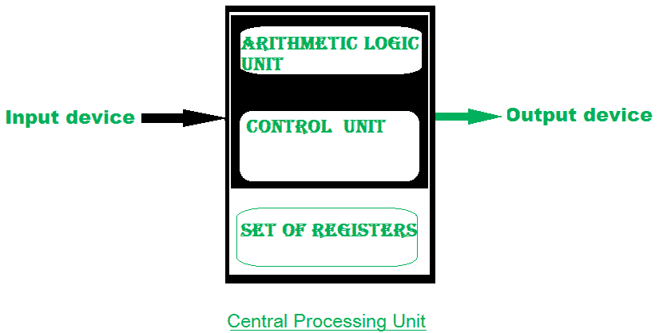
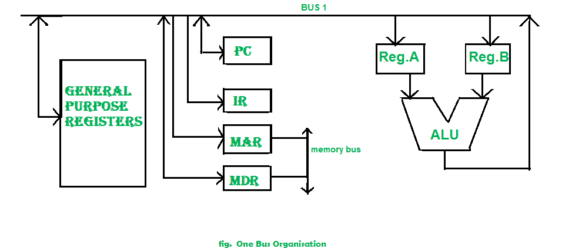
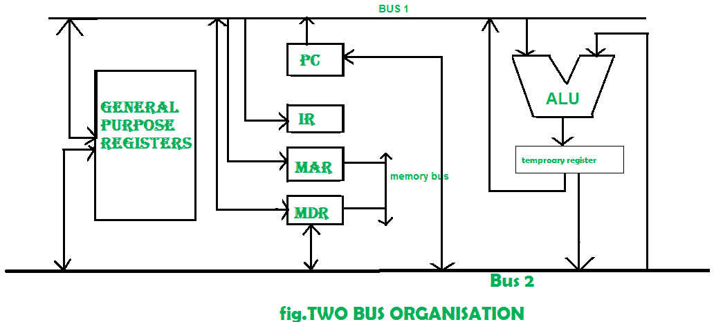
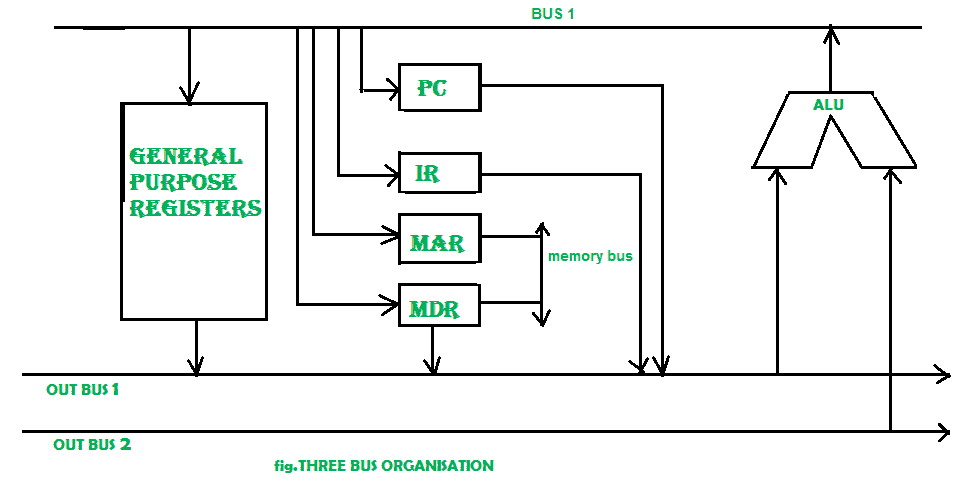

# ALU 和数据路径介绍

> 原文:[https://www . geesforgeks . org/introduction-of-alu-and-data-path/](https://www.geeksforgeeks.org/introduction-of-alu-and-data-path/)

表示和存储数字是早期计算机的基本操作。真正的挑战来了，当计算，像加法，乘法一样操作数字进入画面。这些操作由计算机的**算术逻辑单元**处理。算术逻辑单元是计算机的数学大脑。第一个 ALU 是英特尔 74181，作为 7400 系列实现，是 1970 年发布的 TTL 集成电路。

**ALU** 是一个提供算术和逻辑运算的数字电路。它是计算机中央处理器的基本构件。现代的中央处理器有一个非常强大的算术逻辑单元，而且设计复杂。除了算术逻辑单元，现代的中央处理器还包含一个控制单元和一组寄存器。大多数操作由一个或多个从输入寄存器加载数据的算术逻辑单元执行。寄存器是 CPU 可用的少量存储空间。这些寄存器可以快速访问。控制单元告诉算术逻辑单元对可用数据执行什么操作。在计算/操作之后，算术逻辑单元将输出存储在输出寄存器中。

中央处理器可以分为两部分:数据部分和控制部分。数据段也称为数据路径。**总线:**在早期的计算机中，“总线”是具有多个硬件连接的并行电线。因此，总线是一种在计算机内部组件之间或计算机之间传输数据的通信系统。它包括硬件组件，如电线、光纤等，以及软件，包括通信协议。寄存器、算术逻辑单元和互连总线统称为数据路径。

总线的类型有:

1.  **地址总线:**用于传送地址的总线。

2.  **数据总线:**用于传输数据的总线。

3.  **控制总线:**如果总线携带控制信号。

4.  **电源总线:**如果它携带时钟脉冲、电源信号，则称为电源总线，依此类推。

总线可以是专用的，即它可以用于一个目的，也可以是多路复用的，即它可以用于多个目的。当我们有不同类型的公共汽车时，就会有不同类型的公共汽车组织出现。

*   **Program Counter –** 
    A program counter (PC) is a CPU register in the computer processor which has the address of the next instruction to be executed from memory. As each instruction gets fetched, the program counter increases its stored value by 1\. It is a digital counter needed for faster execution of tasks as well as for tracking the current execution point. 
*   **Instruction Register –** 
    In computing, an instruction register (IR) is the part of a CPU’s control unit that holds the instruction currently being executed or decoded. An instruction register is the part of a CPU’s control unit that holds the instruction currently being executed or decoded. The instruction register specifically holds the instruction and provides it to the instruction decoder circuit. 
*   **Memory Address Register –** 
    The Memory Address Register (MAR) is the CPU register that either store the memory address from which data will be fetched from the CPU, or the address to which data will be sent and stored. It is a temporary storage component in the CPU(central processing unit) that temporarily stores the address (location) of the data sent by the memory unit until the instruction for the particular data is executed. 
*   **Memory Data Register –** 
    The memory data register (MDR) is the register in a computer’s processor, or central processing unit, CPU, that stores the data being transferred to and from the immediate access storage. Memory data register (MDR) is also known as memory buffer register (MBR). 
*   **通用寄存器–**
    通用寄存器用于在微处理器内存储临时数据。这是一个多用途寄存器。程序员或用户都可以使用它们。

**一个公交组织–**

在一个总线组织中，单个总线用于多种目的。一组通用寄存器、程序计数器、指令寄存器、存储器地址寄存器(MAR)、存储器数据寄存器(MDR)与单总线相连。内存读/写可以用 MAR 和 MDR 完成。该程序与下一条指令的提取位置相对应。指令寄存器就是保存当前指令副本的寄存器。在一个总线组织的情况下，一次只能从总线中读取一个操作数。

因此，如果要求为操作读取两个操作数，则读取操作需要执行两次。所以这就是为什么它让这个过程变得更长了。一个总线组织的优点之一是它是最简单的，而且实现起来非常便宜。同时缺点在于它只有一条总线，而这“一条总线”被所有通用寄存器、程序计数器、指令寄存器、MAR、MDR 访问，使得每一个操作都是顺序的。如今没有人推荐这种建筑。**两个总线组织–**
两个克服了一个总线组织的缺点，开发了另一个架构，称为两个总线组织。在两个公共汽车组织中，有两辆公共汽车。通用寄存器可以从两条总线读取/写入。在这种情况下，由于两条总线，可以同时提取两个操作数。一个总线取操作数用于 ALU，另一个总线取操作数用于寄存器。当两条总线都忙于获取操作数时，输出可以存储在临时寄存器中，当总线空闲时，特定输出可以转储到总线上。

两种公交组织有两种版本，即车内公交和车外公交。从内部总线，通用寄存器可以读取数据，从外部总线，通用寄存器可以写入数据。在这里公共汽车是专用的。

**三个巴士组织–**
在三个巴士组织中，我们有三个巴士，输出巴士 1、输出巴士 2 和输入巴士。从输出总线上，我们可以得到操作数，它可以来自通用寄存器，并在算术逻辑单元中计算，输出放在输入总线上，以便发送到相应的寄存器。这种实现有点复杂，但本质上更快，因为两个操作数可以并行流入和流出算术逻辑单元。它的开发是为了克服两个公交组织的“繁忙等待”问题。在这种结构中，在执行之后，由于存在额外的总线，输出可以被丢弃在总线上而无需等待。结构如下图所示。

多总线组织相对于单总线的主要**优势**如下。

1.  增加寄存器的大小。

2.  减少执行周期数。
3.  提高执行速度或者我们可以说更快的执行。