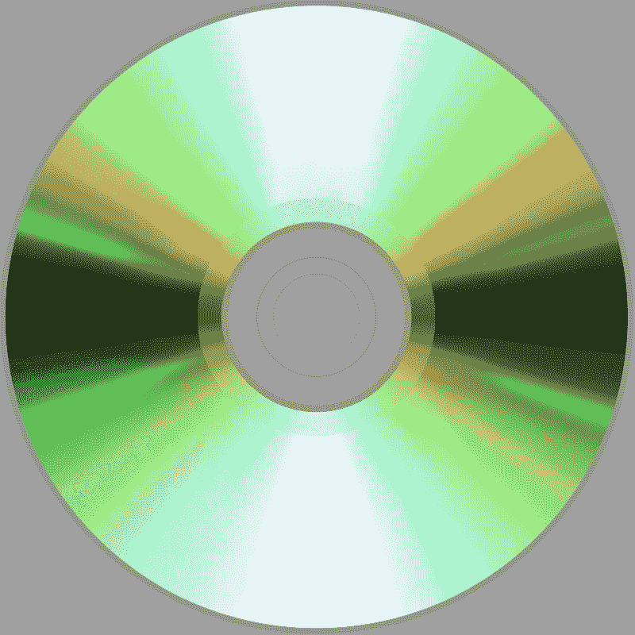

# 推出光盘光存储器

> 原文:[https://www . geesforgeks . org/光盘-光盘-内存简介/](https://www.geeksforgeeks.org/introduction-of-compact-disk-cd-optical-memory/)

**光存储器**由飞利浦和索尼研发，1982 年在第四代电脑中发布。这些存储器使用光束进行操作，并且需要光驱进行操作。这些存储器用于存储音频/视频、备份以及保存数据。与硬盘和闪存相比，读/写速度较慢。光存储器的例子有光盘、数字多功能盘和蓝光光盘。

在这里，我们只简单地讨论了光盘。

**光盘:**
存储数据，有圆形塑料，塑料单面涂铝合金存储数据。它由额外的薄塑料覆盖层保护。光盘需要光驱才能运行。

[Image from Wikipedia](https://en.wikipedia.org/wiki/Compact_disc#/media/File:OD_Compact_disc.svg) – Compact Disk (CD)

一张光盘可以存储比个人电脑硬盘多得多的数据。光盘的存储容量通常高达 700 兆字节(80 分钟的音频)。

**光盘类型:**
以下是各种类型的光盘。

1.  **cd-r–**是一张空白的 CD，其中可以存储一次数据，在上面存储数据后称为 CD-ROM。
2.  **光驱–**变成了 ROM(只读存储器)，在里面不能更新或删除数据。只有您可以使用光驱读取数据。
3.  **CD-RW–**如果您愿意，可以多次更新或删除数据。

**CD 的优势:**

1.  它可以长时间存储数据，即持久内存。
2.  它是一种可靠且广泛使用的存储器。
3.  它提供随机数据访问。
4.  它不受磁场的影响。
5.  它很经济，即在更小的空间中存储更多的数据。

**CD 的缺点:**

1.  这是一个很好的内存，但比磁盘慢。
2.  在光盘上写或复制数据并不容易。