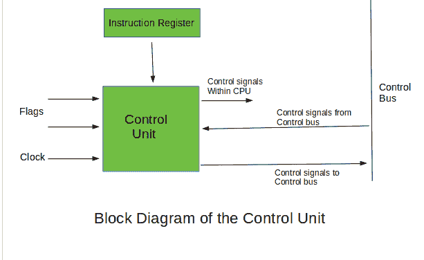
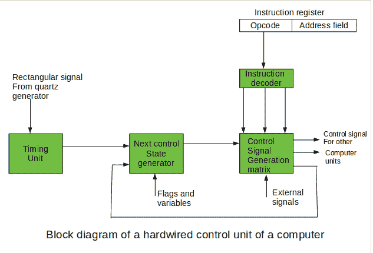
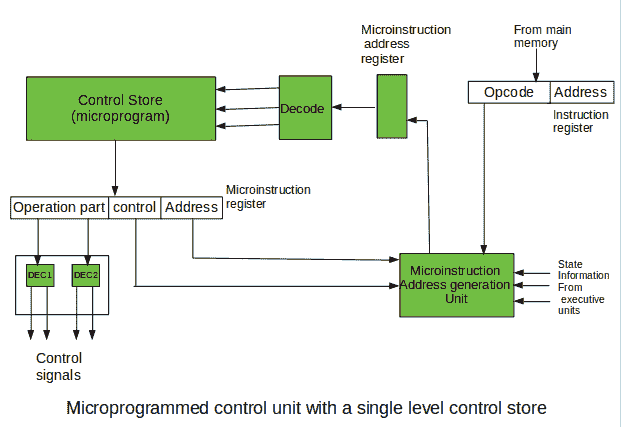
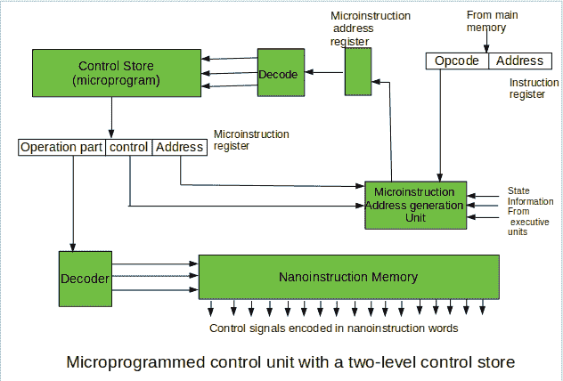

# 控制单元及其设计介绍

> 原文:[https://www . geesforgeks . org/控制单元及其设计简介/](https://www.geeksforgeeks.org/introduction-of-control-unit-and-its-design/)

**控制单元**是计算机中央处理器(CPU)的一部分，它指导处理器的操作。它被约翰·冯·诺依曼列为冯·诺依曼建筑的一部分。控制单元负责告诉计算机的存储器、算术/逻辑单元以及输入和输出设备如何响应发送给处理器的指令。它从主存储器中取出程序的内部指令到处理器指令寄存器中，根据这个寄存器的内容，控制单元产生一个控制信号来监督这些指令的执行。

控制单元通过接收输入信息来工作，并将其转换成控制信号，然后发送到中央处理器。然后，计算机的处理器告诉连接的硬件要执行什么操作。控制单元执行的功能取决于中央处理器的类型，因为中央处理器的体系结构因制造商而异。需要 CU 的设备示例有:

*   控制处理单元
*   图形处理单元

**控制单元的功能–**

1.  它协调处理器的许多子单元之间的数据进出顺序。
2.  它解释指令。
3.  它控制处理器内部的数据流。
4.  它接收外部指令或命令，并将其转换为控制信号序列。
5.  它控制包含在中央处理器中的许多执行单元(即算术逻辑单元、数据缓冲器和寄存器)。
6.  它还处理多个任务，例如获取、解码、执行处理和存储结果。

**控制单元的类型–**
控制单元有两种类型:硬连线控制单元和可微程序控制单元。

1.  **Hardwired Control Unit –**
    In the Hardwired control unit, the control signals that are important for instruction execution control are generated by specially designed hardware logical circuits, in which we can not modify the signal generation method without physical change of the circuit structure. The operation code of an instruction contains the basic data for control signal generation. In the instruction decoder, the operation code is decoded. The instruction decoder constitutes a set of many decoders that decode different fields of the instruction opcode.

    结果，从指令解码器出来的输出线很少获得有效信号值。这些输出线连接到矩阵的输入端，该矩阵为计算机的执行单元产生控制信号。该矩阵实现了来自指令操作码的解码信号与来自矩阵的输出的逻辑组合，该矩阵产生表示连续控制单元状态的信号，以及来自处理器外部的信号，例如中断信号。矩阵的构建方式与可编程逻辑阵列相似。

    

    用于指令执行的控制信号必须不是在单个时间点产生，而是在对应于指令执行周期的整个时间间隔期间产生。按照这个循环的结构，在控制单元中组织适当的内部状态序列。

    由控制信号发生器矩阵产生的许多信号被发送回下一个控制状态发生器矩阵的输入端。该矩阵将这些信号与定时信号相结合，该定时信号由定时单元基于通常由石英发生器提供的矩形图案产生。当新指令到达控制单元时，控制单元处于新指令提取的初始状态。指令解码允许控制单元进入与新指令的执行相关的第一状态，只要作为标志的定时信号和其它输入信号以及计算机的状态信息保持不变，该状态就会持续。前面提到的任何信号的改变都会刺激控制单元状态的改变。

    这导致为控制信号发生器矩阵生成新的相应输入。当外部信号出现时(例如中断)，控制单元进入下一个控制状态，即与对该外部信号的反应有关的状态(例如中断处理)。计算机的标志和状态变量的值用于为指令执行周期选择合适的状态。

    循环中的最后状态是开始获取程序的下一条指令的控制状态:将程序计数器内容发送到主存储器地址缓冲寄存器，然后将指令字读取到计算机的指令寄存器。当正在执行的指令是结束程序执行的停止指令时，控制单元进入操作系统状态，在该状态下，它等待下一个用户指令。

2.  **Microprogrammable control unit –**
    The fundamental difference between these unit structures and the structure of the hardwired control unit is the existence of the control store that is used for storing words containing encoded control signals mandatory for instruction execution.

    在微程序控制单元中，随后的指令字以正常方式被读入指令寄存器。然而，每条指令的操作码并不直接解码以产生即时控制信号，而是包含控制存储器中微程序的初始地址。

    *   **With a single-level control store:**
        In this, the instruction opcode from the instruction register is sent to the control store address register. Based on this address, the first microinstruction of a microprogram that interprets execution of this instruction is read to the microinstruction register. This microinstruction contains in its operation part encoded control signals, normally as few bit fields. In a set microinstruction field decoders, the fields are decoded. The microinstruction also contains the address of the next microinstruction of the given instruction microprogram and a control field used to control activities of the microinstruction address generator.

        

        最后提到的字段决定要应用于嵌入正在进行的微指令中的地址的寻址模式(寻址操作)。在微指令和条件寻址模式中，这个地址通过使用代表当前程序中计算状态的处理器条件标志来改进。给定微程序指令中的最后一条微指令是将下一条指令从主存储器取出到指令寄存器的微指令。

    *   **With a two-level control store:**
        In this, in a control unit with a two-level control store, besides the control memory for microinstructions, a nano-instruction memory is included. In such a control unit, microinstructions do not contain encoded control signals. The operation part of microinstructions contains the address of the word in the nano-instruction memory, which contains encoded control signals. The nano-instruction memory contains all combinations of control signals that appear in microprograms that interpret the complete instruction set of a given computer, written once in the form of nano-instructions.

        

        这样，避免了微指令的相同操作部分的不必要的存储。在这种情况下，微指令字可以比单级控制存储短得多。它使微指令存储器的位数变得小得多，结果使整个控制存储器的大小变得小得多。微指令存储器包含选择连续微指令的控制，而那些控制信号是在纳米指令的基础上产生的。在纳米指令中，控制信号经常使用 1 位/ 1 信号方法进行编码，这种方法消除了解码。