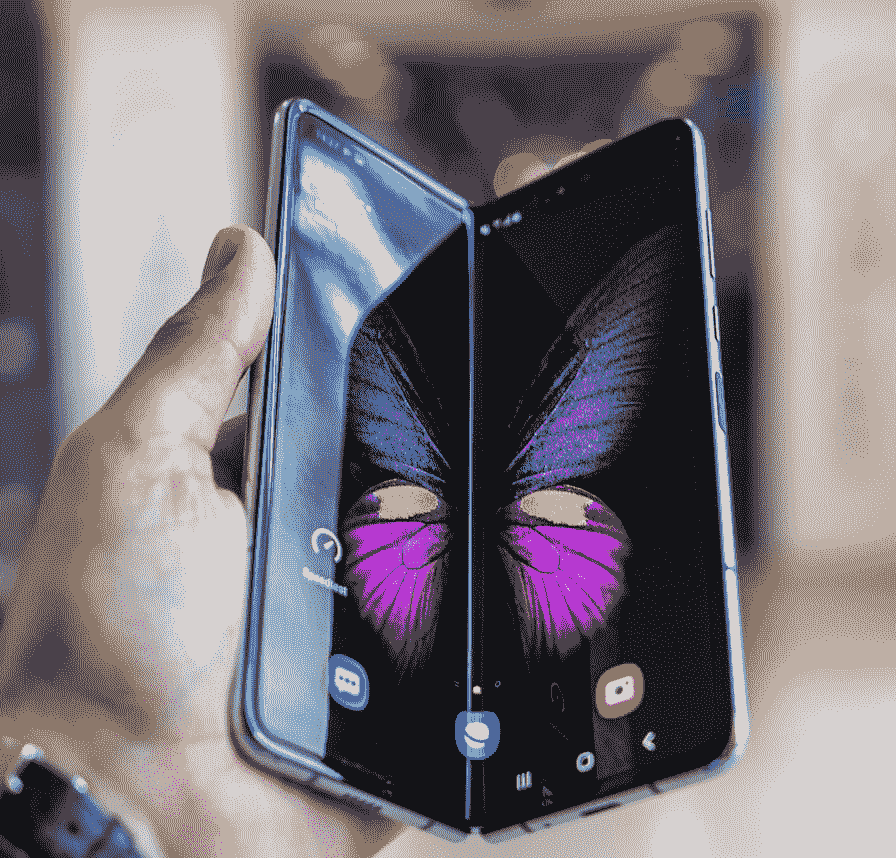
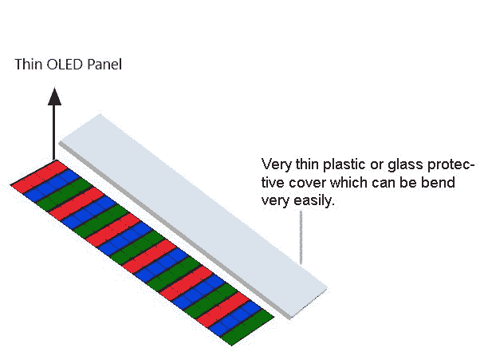

# 折叠屏介绍

> 原文:[https://www . geesforgeks . org/可折叠屏幕介绍/](https://www.geeksforgeeks.org/introduction-of-foldable-screens/)

**可折叠屏幕**，曾经被认为是不可能的，但在如今这个时代似乎没有什么是不可能的，而这些可折叠屏幕以可折叠手机的形式成为了现实。这款手机打开后会变成平板电脑，折叠后会变成口袋大小的智能手机。但是，问题是他们是如何实现这一技术壮举的。
嗯，答案是柔性屏幕；这是其他几项进步之一，也是可折叠设备和轻薄电视的重要组成部分。

**Image credits: –** Photo by Mika Baumeister on Unsplash

The screens used for making foldable devices are known as OLED (Organic Light Emitting Diode), and are made up of organic compounds, when electricity is passed through them they emit their own light, which means these screens do not require backlit lights for working, making screens more thin and flexible and also they generate more accurate colors and have a large color gamut, unlike LCD’s which require a back-lit light source for working due to which LCD’s become heavy and thick.
LED displays are actually printed on a thin layer of plastic, which allows them to bend and fold in many different ways.

**可折叠显示器的工作原理:**
屏幕非常薄，因此它们可以很容易地弯曲，因为它们被印刷在柔性塑料膜上。大多数设备不是使用钢化玻璃来保护屏幕，而是使用塑料材料来保护屏幕，保持其可折叠的特性。

如图所示，彩色发光二极管由有机化合物制成，顶层由透明塑料或可折叠的非常薄的玻璃片制成。有机发光二极管面板生产自己的光缓解需要一个背部发光二极管面板为他们的工作。工作很简单，但非常有效，同样，我们正在向 QLED 显示器发展，那里的像素非常小，我们可能几乎不会注意到它们。

三星 galaxy Z-flip 是唯一一款拥有真正可折叠玻璃的手机，玻璃折叠的原因是，它非常薄，玻璃制造商说，“如果你能制造足够薄的玻璃层，那么你实际上可以弯曲它”。
而三星 galaxy fold 没有防护玻璃，取而代之的是一张薄薄的塑料覆盖屏幕。

**利弊:**

**1。优点–**

*   有机发光二极管显示器产生鲜艳的颜色
*   拥有广阔的色域。
*   产生自己的光。
*   可以做得很薄。

**2 .cons-**

*   显示器很贵。
*   如果某些内容在同一帧中长时间停留在屏幕上，该帧就会被印在显示器上，从而干扰其他内容。
*   屏幕会随着折叠和展开而磨损。

第一个问题是，随着时间的推移，屏幕会随着不断的折叠和展开而损坏，而且由于用户必须与屏幕交互，它会在一段时间内损坏。
最后但并非最不重要的是，这些显示器很贵，因为 galaxy fold 本身的价格约为 2000 美元，接近 144000 印度卢比，比任何其他设备都贵。类似的由柔性屏幕制成的设备，如电视、显示器，实际上成本很高。

那么，这些显示器的未来会怎样呢？嗯，专家说，未来的小工具肯定会使用可折叠显示器来管理空间、移动性、耐用性等。