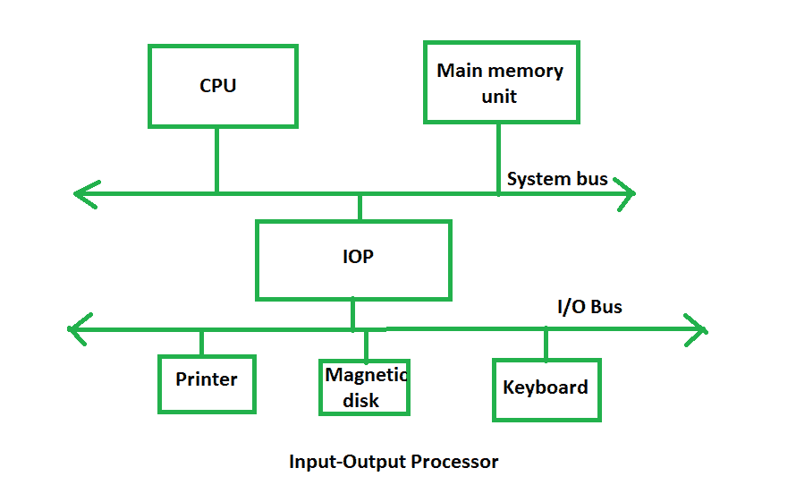

# 输入输出处理器介绍

> 原文:[https://www . geesforgeks . org/输入输出处理器简介/](https://www.geeksforgeeks.org/introduction-of-input-output-processor/)

数据传输的 **DMA 模式**减少了中央处理器处理输入输出操作的开销。它还允许并行处理中央处理器和输入/输出操作。这种并行性是必要的，以避免在处理速度比中央处理器慢得多的输入/输出设备时浪费宝贵的中央处理器时间。可以扩展直接存储器存取操作的概念，以进一步减轻中央处理器参与输入/输出操作的执行。这催生了名为**输入输出处理器或输入输出通道**的专用处理器的发展。

输入输出处理器就像一个处理输入输出操作细节的中央处理器。它配备了比典型的直接存储器存取控制器更多的设备。IOP 可以获取并执行自己的指令，这些指令是专门为描述输入/输出传输而设计的。除了与输入/输出相关的任务，它还可以执行其他处理任务，如算术、逻辑、分支和代码翻译。主存储单元起着举足轻重的作用。它通过直接存储器存取与处理器通信。

**框图–**

输入输出处理器是一个专门的处理器，它随着输入输出指令的执行将数据加载和存储到内存中。它充当系统和设备之间的接口。它包括一系列事件来执行输入/输出操作，然后将结果存储到内存中。

**优势–**

*   在基于输入/输出处理器的系统中，输入/输出设备可以直接访问主存储器，而无需处理器的干预。
*   它用于解决直接内存访问方法中出现的问题。