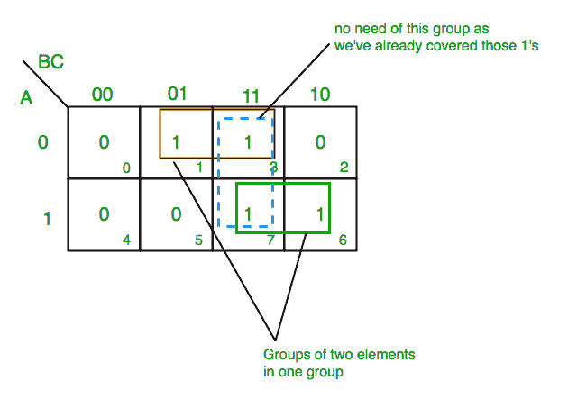
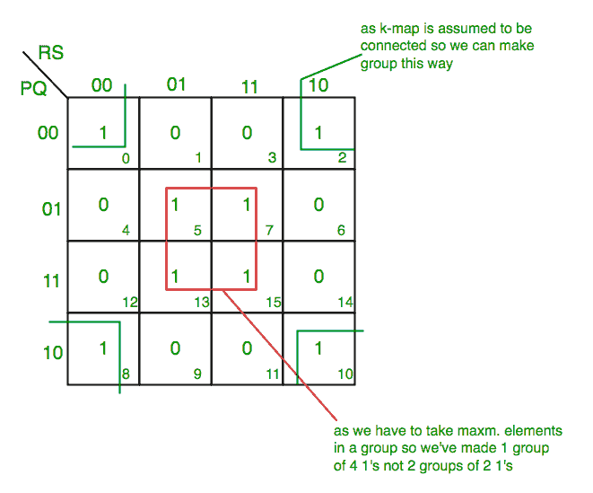
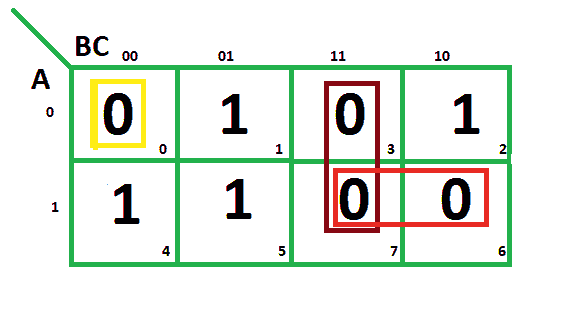
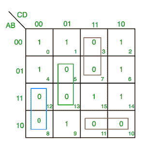

# K 图(卡诺图)介绍

> 原文:[https://www . geesforgeks . org/introduction-of-k-map-Karnaugh-map/](https://www.geeksforgeeks.org/introduction-of-k-map-karnaugh-map/)

在许多数字电路和实际问题中，我们需要找到具有最小变量的表达式。我们可以使用 K-map 非常容易地最小化 3，4 变量的布尔表达式，而不使用任何布尔代数定理。根据问题的需要，K-map 可以采用乘积和和和乘积两种形式。K-map 类似于表的表示，但它比真值表给出更多的信息。我们用 0 和 1 填充 K 图的网格，然后通过分组来求解。

**<u>使用 K-map 求解表达式的步骤-</u>**

1.  根据变量数量选择 K-map。
2.  确定问题中给出的最小项或最大项。
3.  对于标准操作程序，将 1 放入对应于最小项的 K 图块中(其他地方为 0)。
4.  对于位置，将 0 放入与最大项相对应的 K-map 块中(其他地方为 1)。
5.  制作包含 2，4，8 等 2 次方项的矩形群..(除了 1)尽量在一组中涵盖尽可能多的元素。
6.  从第 5 步中组成的小组中找到产品术语，并将其总结为标准操作程序形式。

**<u>标准操作程序表格:</u>**

**<u>1。3 个变量的 k 图–</u>**

```
Z= ∑A,B,C(1,3,6,7)  
```



从**红色**组我们得到产品术语——

```
A’C 
```

从**绿色**组我们得到产品术语——

```
AB 
```

将这些乘积项相加，我们得到- **最终表达式(A'C+AB)**

**<u>2。4 个变量的 k 图–</u>**

```
F(P,Q,R,S)=∑(0,2,5,7,8,10,13,15)  
```

[](https://media.geeksforgeeks.org/wp-content/uploads/K-Map-Karnaugh-Map-2-1.png)

从**红色**组我们得到产品术语——

```
QS 
```

从**绿色**组我们得到产品术语——

```
Q’S’ 
```

将这些乘积项相加，我们得到- **最终表达式(QS+Q 的 s’)**

**<u>POS 表单:</u>**

**<u>1。3 个变量的 k 图–</u>**

```
F(A,B,C)=π(0,3,6,7)
```



从**红色**组我们找到术语

```
A    B   
```

取这两者的补码

```
A'     B'    
```

现在把它们加起来

```
(A' + B') 
```

从**棕色**组我们找到了术语

```
B   C 
```

取这两个词的补语

```
B’  C’ 
```

现在总结一下

```
(B’+C’) 
```

从**黄色**组中我们找到术语

```
A' B' C’ 
```

取这两者的补码

```
A B C 
```

现在把它们加起来

```
(A + B + C) 
```

我们将取这三个术语的乘积:**最终表达式–**

```
(A' + B’) (B’ + C’) (A + B + C) 
```

**<u>2。4 个变量的 k 图–</u>**

```
F(A,B,C,D)=π(3,5,7,8,10,11,12,13) 
```



从**绿色**组我们找到条款

```
C’  D  B 
```

取它们的补码并求和

```
(C+D’+B’) 
```

从**红色**组我们找到术语

```
C  D  A’ 
```

取它们的补码并求和

```
(C’+D’+A) 
```

从**蓝色**组中我们找到术语

```
A  C’  D’ 
```

取它们的补码并求和

```
(A’+C+D) 
```

从**棕色**组我们找到了术语

```
A  B’  C 
```

取它们的补码并求和

```
(A’+B+C’) 
```

最后，我们将这些表示为产品–

```
(C+D’+B’).(C’+D’+A).(A’+C+D).(A’+B+C’) 
```

**<u>PITFALL</u>–***永远记住***POS≦(SOP)'***

*正确的形式是(F 的**位置)=(F 的 SOP)'**

[知识图谱测验](https://www.geeksforgeeks.org/digital-logic-number-representation-gq/)

本文由 Anuj Bhatam 供稿。如果发现有不正确的地方，请写评论，或者想分享更多关于以上讨论话题的信息