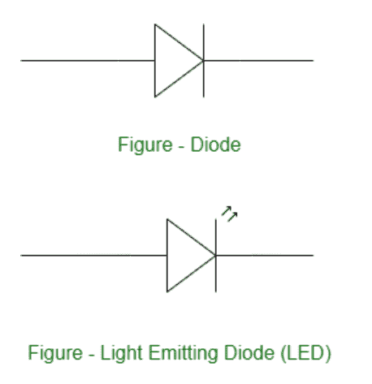

# LED

介绍

> 原文:[https://www.geeksforgeeks.org/introduction-of-led/](https://www.geeksforgeeks.org/introduction-of-led/)

有各种各样的光源，像蜡烛、灯等。灯泡是托马斯·爱迪生在 1879 年发明的。发光二极管，电子电能可以直接转换成光能。你可以在汽车、自行车、路灯、家庭照明、办公室照明、手机、电视等等中找到发光二极管。

光是原子释放的能量。发光二极管是由于电致发光效应而发光的半导体器件。发光二极管基本上是 PN 结二极管，当正向偏置时会发光。

与 CFL 相比，发光二极管有许多优势，例如:

*   小尺寸
*   低功耗
*   快速切换
*   持久的
*   身体强壮等。

发光二极管在一大群人中变得相当受欢迎。

发光二极管由 PN 结二极管组成，当电压施加到发光二极管上时，电子和空穴在 PN 结中复合，并以光(光子)的形式释放能量。发光二极管的电气符号类似于 PN 结二极管。n 型材料应该带负电荷，p 型材料应该带正电荷，以产生发光二极管。

发光二极管使用半导体，当正向偏置时，半导体发射可见光或不可见光。电致发光是在正向偏压下，当导带中的自由电子与价带中的空穴复合时，能量以光的形式释放的过程。

发光二极管可以制造成发射可见光谱的所有波长，即从红色(620 纳米到 750 纳米)到蓝色-紫色(380 纳米到 490 纳米)。发光二极管发出的光通常是单色的，这意味着单色取决于半导体的能带隙。

**发光二极管的层数:**
这是发光模式下的三层(发光二极管):

1.  **P 型半导体–**空穴是多数电荷载流子。
2.  **N 型半导体-** 自由电子是多数电荷载流子。
3.  **耗尽层或耗尽区–**不存在电荷载流子(自由电子或空穴)的 p 型和 n 型半导体。

**耗尽层或区域**是电流的屏障。你需要施加大于该层势垒的电压来克服该势垒。