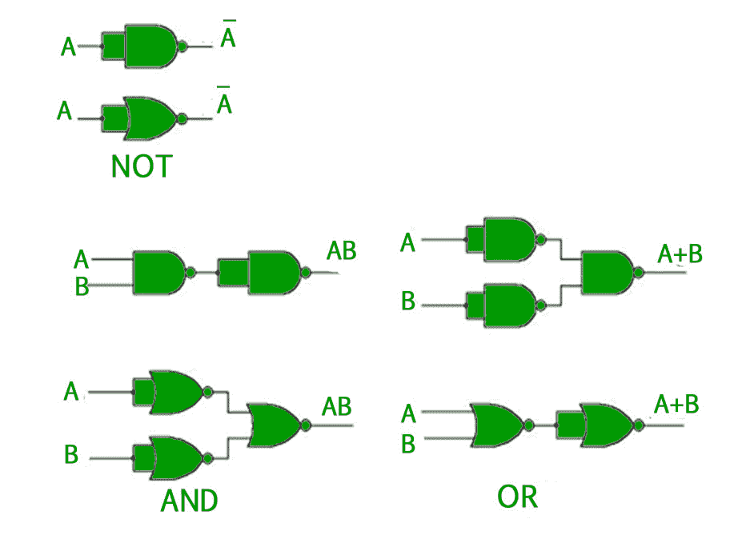
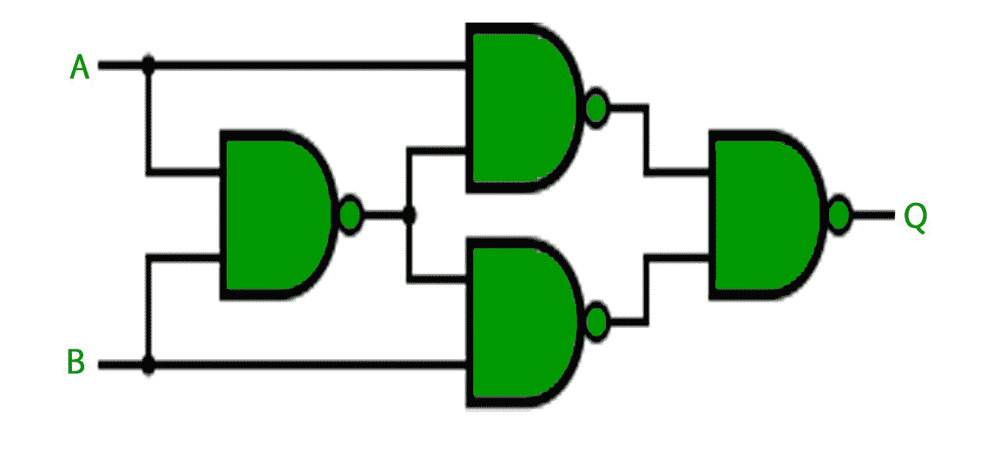
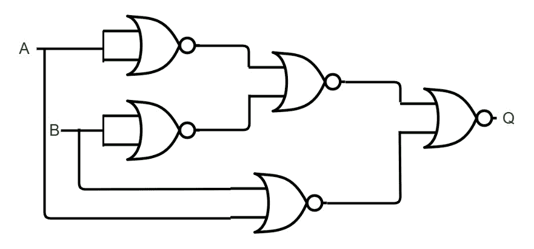

# 逻辑门介绍

> 原文:[https://www.geeksforgeeks.org/introduction-of-logic-gates/](https://www.geeksforgeeks.org/introduction-of-logic-gates/)

在布尔代数中，有三种基本运算，类似于[命题逻辑](https://www.geeksforgeeks.org/proposition-logic/)中的析取、合取和否定。这些操作中的每一个都有相应的逻辑门。除了这些，还有一些其他的逻辑门。

**逻辑门–**

*   **与门(。)–**如果两个输入都是 1，与门给出的输出为 1，否则为 0。
*   **或门(+)–**如果两个输入中的任何一个为 1，或门输出为 1，否则输出为 0。
*   **非门(')–**非门的输出为 1，输入为 0，反之亦然。
*   **XOR gate(**

    ```
    *** QuickLaTeX cannot compile formula:

    *** Error message:
    Error: Nothing to show, formula is empty

    ```

    **)–**异或门给出 1 的输出，如果两个输入不同，则给出 0。

如果上述门的输出被否定，则获得另外三个逻辑门。

*   **NAND gate(**

    ```
    *** QuickLaTeX cannot compile formula:

    *** Error message:
    Error: Nothing to show, formula is empty

    ```

    **)-** 与非门(否定的“与”)给出 0 的输出，如果两个输入都是 1，则给出 1。

*   **NOR gate(**

    ```
    *** QuickLaTeX cannot compile formula:

    *** Error message:
    Error: Nothing to show, formula is empty

    ```

    **)-** 如果两个输入都为 0，或非门(求反或)给出 1 的输出，否则给出 0。

*   **XNOR gate(**

    ```
    *** QuickLaTeX cannot compile formula:

    *** Error message:
    Error: Nothing to show, formula is empty

    ```

    **)-**XNOR 门(求反异或)给出 1 的输出，如果两个输入相同，则为 0。

每个逻辑门都有一个与之相关的图形表示或符号。下图显示了与每个逻辑门相关的图形符号和真值表。


**通用逻辑门–**
在上面讨论的七个逻辑门中，与非门和或非门也被称为**通用门**，因为它们可以用来实现任何数字电路，而无需使用任何其他门。这意味着每个门只能由与非门或或非门创建。
使用与非门和或非门的三个基本门的实现如下所示–



对于**异或门**，与非门和或非门的实现是–

使用“与非”–实现

****

**使用或非-实现**

********

******注–**为了实现 XNOR 门，可以在上述电路中增加一个 NAND 或 NOR 门，以否定 XOR 门的输出。****

******GATE CS 角题:**
练习以下几道题有助于测试你的知识。所有的问题在前几年的 GATE 考试或 GATE 模拟考试中都被问过。强烈建议你练习一下。****

****1. [GATE CS 2013，第 21 题](https://www.geeksforgeeks.org/gate-gate-cs-2013-question-21/)
2。 [GATE CS 2012，第 10 题](https://www.geeksforgeeks.org/gate-gate-cs-2012-question-10-3/)
3。 [GATE CS 2007，问题 33](https://www.geeksforgeeks.org/gate-gate-cs-2007-question-33/)
4。 [GATE CS 2005，第 15 题](https://www.geeksforgeeks.org/gate-gate-cs-2005-question-15/)****

******参考资料–**
数字设计，第 5 版，作者:莫里斯·马诺和迈克尔·西莱蒂****

****本文由**奇拉·曼瓦尼**供稿。如果你喜欢 GeeksforGeeks 并想投稿，你也可以使用[contribute.geeksforgeeks.org](http://www.contribute.geeksforgeeks.org)写一篇文章或者把你的文章邮寄到 contribute@geeksforgeeks.org。看到你的文章出现在极客博客主页上，帮助其他极客。****

****如果你发现任何不正确的地方，或者你想分享更多关于上面讨论的话题的信息，请写评论。****