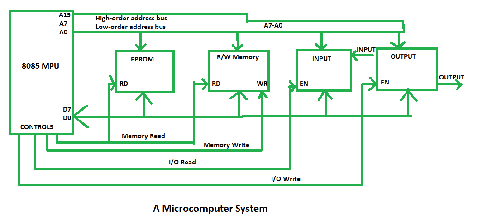

# 微机系统介绍

> 原文:[https://www . geesforgeks . org/微机系统简介/](https://www.geeksforgeeks.org/introduction-of-microcomputer-system/)

[8085 微处理器](https://www.geeksforgeeks.org/pin-diagram-8085-microprocessor/)是微型计算机系统的一个例子。微处理器系统包含两种类型的存储器，即 EPROM 和 R/WM、输入和输出设备，以及用于将所有外围设备(存储器和输入/输出设备)连接到微处理器的总线。

在 8085 中，我们有 16 条地址线，范围从 A0 到 A15，用于寻址存储器。低位**地址总线 A0-A7** 用于识别输入和输出设备。该微机系统有 8 条**数据线 D0-D7** ，它们是双向的，所有设备共用。

它产生四个**控制信号**:内存读取、内存写入、I/O 读取和 I/O 写入，它们连接到不同的外围设备。微处理器通过其控制信号使能外围设备，一次只与一个外围设备通信。

例如，向输出设备发送数据时，微处理器将设备地址(或输出端口号)放在地址总线上，将数据放在数据总线上，并通过使用其控制信号输入/输出写入来启用输出设备。之后，输出设备显示结果。

另一个未使能的外设保持高阻抗状态，称为三态。总线驱动器增加总线的当前驱动能力，解码器解码地址以识别输出端口，锁存器保存数据输出以供显示。这些设备被称为接口设备。这些接口设备是将外围设备连接到总线系统所需的半导体芯片。

微型计算机系统的框图如下所示:

