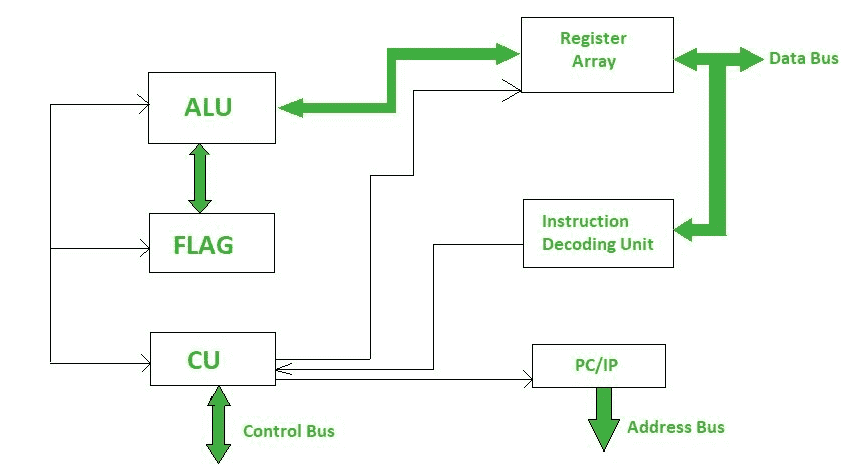

# 微处理器介绍

> 原文:[https://www . geesforgeks . org/微处理器简介/](https://www.geeksforgeeks.org/introduction-of-microprocessor/)

微处理器是计算机体系结构的重要组成部分，没有它，您将无法在计算机上执行任何操作。它是一个可编程设备，接收输入，对其执行一些算术和逻辑运算，并产生所需的输出。简而言之，微处理器是芯片上的数字设备，可以从内存中获取指令，解码并执行它们，并给出结果。

**微处理器基础知识–**
微处理器接受一堆机器语言的指令并执行它们，告诉处理器它必须做什么。微处理器在执行指令时执行三项基本任务:

1.  它使用算术和逻辑单元(ALU)执行一些基本操作，如加法、减法、乘法、除法和一些逻辑操作。新的微处理器也对浮点数进行运算。

2.  微处理器中的数据可以从一个位置移动到另一个位置。

3.  它有一个程序计数器(PC)寄存器，根据 PC 的值存储下一条指令的地址，微处理器从一个位置跳到另一个位置并做出决定。

典型的微处理器结构是这样的。



**不同微处理器的时钟速度:**

*   **16 位微处理器–**

```
8086: 4.7MHz, 8MHz, 10MHz

8088: more than 5MHz

80186/80188: 6MHz

80286: 8MHz 
```

*   **32 位微处理器–**

```
INTEL 80386: 16MHz to 33MHz

INTEL 80486: 16MHz to 100MHz

PENTIUM: 66MHz 
```

*   **64 位微处理器–**

```
INTEL CORE-2: 1.2GHz to 3GHz

INTEL i7: 66GHz to 3.33GHz

INTEL i5: 2.4GHz to 3.6GHz

INTEL i3: 2.93GHz to 3.33GHz 
```

我们目前没有任何 128 位微处理器在工作，其中一个原因是我们离耗尽 64 位地址空间本身还有很长的路要走，我们以大约每 3 年 2 位的恒定速率使用它。目前我们只使用了 64 位中的 48 位，那么为什么需要 128 位地址空间呢？此外，128 位微处理器将比 64 位微处理器慢得多。

**处理器类型:**

*   **Complex Instruction Set Computer (CISC) –** 
    CISC or Complex Instruction Set Computer is a computer architecture where instructions are such that a single instruction can execute multiple low-level operations like loading from memory, storing into memory, or an arithmetic operation, etc. It has multiple addressing nodes within a single instruction.CISC makes use of very few registers. 

    **示例:**

```
1\. Intel 386 
2\. Intel 486
3\. Pentium
4\. Pentium Pro
5\. Pentium II
6\. Pentium III
7\. Motorola 68000
8\. Motorola 68020
9\. Motorola 68040 etc. 
```

*   **Reduced Instruction Set Computer (RISC) –** 
    RISC or Reduced Instruction Set Computer is a computer architecture where instruction is simple and designed to get executed quickly. Instructions get completed in one clock cycle this is because of the optimization of instructions and pipelining (a technique that allows for simultaneous execution of parts, or stages, of instructions more efficiently process instructions). RISC makes use of multiple registers to avoid large interactions with memory. It has few addressing nodes. 

    **示例:**

```
1\. IBM RS6000
2\. MC88100
3\. DEC Alpha 21064
4\. DEC Alpha 21164 
5\. DEC Alpha 21264 
```

*   **Explicitly Parallel Instruction Computing (EPIC) –** 
    EPIC or Explicitly Parallel Instruction Computing permits computers to execute instructions parallel using compilers. It allows complex instructions execution without using higher clock frequencies.EPIC encodes its instruction into 128-bit bundles. each bundle contains three instructions which are encoded in 41 bits each and a 5-bit template field(contains information about types of instructions in a bundle and which instructions can be executed in parallel). 

    **示例:**

```
1\. IA-64 (Intel Architecture-64) 
```