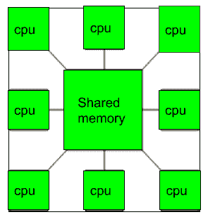
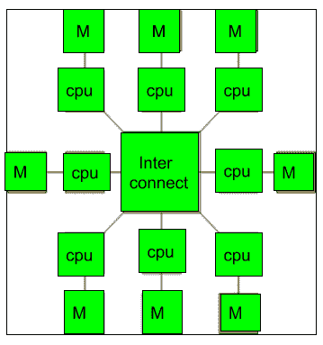

# 多处理器和多计算机介绍

> 原文:[https://www . geesforgeks . org/多处理器和多计算机介绍/](https://www.geeksforgeeks.org/introduction-of-multiprocessor-and-multicomputer/)

**1。多处理器:**
多处理器是一种计算机系统，其中两个或多个中央处理器共享对公共内存的完全访问。使用多处理器的主要目标是提高系统的执行速度，其他目标是容错和应用程序匹配。

有两种类型的多处理器，一种叫做共享内存多处理器，另一种叫做分布式内存多处理器。在共享内存多处理器中，所有的 CPU 共享公共内存，但是在分布式内存多处理器中，每个 CPU 都有自己的私有内存。

**多处理器的应用–**

1.  作为单处理器，如单指令、单数据流(SISD)。
2.  作为多处理器，如单指令多数据流(SIMD)，它通常用于向量处理。
3.  单视角多系列指令，如多指令、单数据流(MISD)，用于描述超线程或流水线处理器。
4.  在单个系统内，用于在多个视角下执行多个独立的指令系列，例如多个指令、多个数据流(MIMD)。

**使用多处理器的优势–**

*   增强的性能。
*   多种应用。
*   应用程序内部的多任务处理。
*   高吞吐量和高响应性。
*   中央处理器之间的硬件共享。

**2。多计算机:**
A [多计算机系统](https://www.geeksforgeeks.org/computer-organization-microcomputer-system/)是由多个处理器连接在一起解决一个问题的计算机系统。每个处理器都有自己的存储器，并且可以被特定的处理器访问，这些处理器可以通过互连网络相互通信。

由于多计算机能够在处理器之间传递消息，因此可以在处理器之间分配任务来完成任务。因此，多计算机可以用于分布式计算。与多处理器相比，构建多计算机更具成本效益，也更容易。

**多处理器和多计算机的区别:**

1.  多处理器是具有两个或更多能够执行多个任务的中央处理器的系统，其中多计算机是具有通过互连网络连接以执行计算任务的多个处理器的系统。
2.  多处理器系统是一台与多个中央处理器一起运行的计算机，其中多计算机系统是一组作为单一计算机运行的计算机。
3.  多计算机的构造比多处理器更容易，成本更低。
4.  在多处理器系统中，编程往往更容易，而在多计算机系统中，编程往往更难。
5.  多处理器支持并行计算，多计算机支持分布式计算。