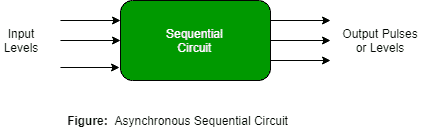
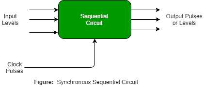

# 时序电路介绍

> 原文:[https://www . geesforgeks . org/时序电路介绍/](https://www.geeksforgeeks.org/introduction-of-sequential-circuits/)

A **时序电路**是由输入变量(X)、逻辑门(计算电路)和输出变量(Z)组成的组合逻辑电路。

组合电路仅基于输入变量产生输出，但是**时序电路**基于**当前输入和先前输入变量**产生输出。这意味着时序电路包括能够存储二进制信息的存储元件。该二进制信息定义了时序电路当时的状态。一种能够存储一位信息的锁存器。

如图所示，组合逻辑有两种类型的输入:

1.  不受电路控制的外部输入。
2.  内部输入是先前输出状态的函数。

次级输入是由存储元件产生的状态变量，而次级输出是对存储元件的激励。

**时序电路的类型–**时序电路有两种类型:

*   **Asynchronous sequential circuit –** These circuits **do not use a clock signal** but uses the pulses of the inputs. These circuits are **faster** than synchronous sequential circuits because there is clock pulse and change their state immediately when there is a change in the input signal. We use asynchronous sequential circuits when speed of operation is important and **independent** of internal clock pulse. 

但是这些电路更难设计，它们的输出是不确定的。

*   **Synchronous sequential circuit –** These circuits **uses clock signal** and level inputs (or pulsed) (with restrictions on pulse width and circuit propagation). The output pulse is the same duration as the clock pulse for the clocked sequential circuits. Since they wait for the next clock pulse to arrive to perform the next operation, so these circuits are bit **slower** compared to asynchronous. Level output changes state at the start of an input pulse and remains in that until the next input or clock pulse. 

我们在同步计数器、触发器和 MOORE-MEALY 状态管理机的设计中使用同步时序电路。

我们使用时序电路来设计计数器、寄存器、随机存取存储器、MOORE/MEALY 机器和其他状态保持机器。

**GATE CS 角题**
练习下面的题有助于测试你的知识。所有的问题在前几年的 GATE 考试或 GATE 模拟考试中都被问过。强烈建议你练习一下。

1.  [GATE CS 2010，第 65 题](https://www.geeksforgeeks.org/gate-gate-cs-2010-question-32/)
2.  [GATE CS 1999，问题 33](https://www.geeksforgeeks.org/gate-gate-cs-1999-question-33/)
3.  [GATE CS 2014(第三集)，第 65 题](https://www.geeksforgeeks.org/gate-gate-cs-2014-set-3-question-55/)

**参考资料–**
[时序电路](http://www.ee.surrey.ac.uk/Projects/Labview/Sequential/Course/03-Seq_Intro/Intro.html)
[时序逻辑–维基百科](https://en.wikipedia.org/wiki/Sequential_logic)

本文由 [Mithlesh Upadhyay](https://www.linkedin.com/in/mithlesh-upadhyay/) 供稿。如果你喜欢极客博客并想投稿，你也可以用 write.geeksforgeeks.org 写一篇文章或者把你的文章邮寄到 review-team@geeksforgeeks.org。看到你的文章出现在极客博客主页上，帮助其他极客。

如果你发现任何不正确的地方，或者你想分享更多关于上面讨论的话题的信息，请写评论。