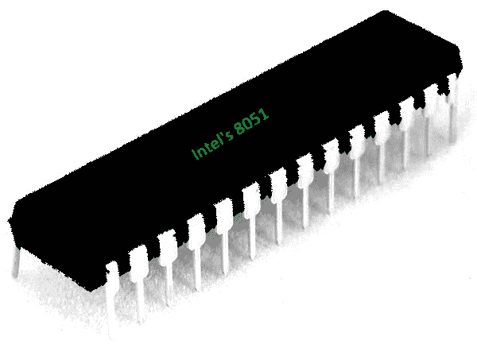

# 8051 微控制器简介

> 原文:[https://www . geesforgeks . org/introduction-to-8051-微控制器/](https://www.geeksforgeeks.org/introduction-to-8051-microcontroller/)

8051 是最早最流行的微控制器之一，也被称为 MCS-51。它是英特尔在 1981 年推出的。最初它是作为基于 N 型金属氧化物半导体(NMOS)的微控制器出现的，但后来的版本是基于互补金属氧化物半导体(CMOS)技术。这些微控制器被命名为 80C51，名字中的 C 表示它基于 CMOS 技术。

它是一个 8 位微控制器，这意味着数据总线是 8 位的。因此，它可以一次处理 8 位。它广泛应用于各种嵌入式系统，如机器人、遥控器、汽车工业、电信应用、电动工具等。

**Figure –** 8051 Microcontroller

**片上系统:**
它被称为片上系统(SoC)微控制器，因为它是一种芯片电路/集成电路，将计算机的许多组件集成在一个芯片上。这些组件包括中央处理器、内存、输入输出端口(输入/输出端口)、定时器和辅助存储器。

**特性–**
8051 有一些关键特性，是学生学习微控制器的基础。这些功能包括

*   4 KB 片内只读存储器(程序存储器)。
*   128 字节片内随机存取存储器(数据存储器)。
*   8 位数据总线(双向)。
*   16 位地址总线(单向)。
*   两个 16 位定时器。
*   12 MHz 晶体的指令周期为 1 微秒。
*   四个 8 位端口。
*   128 个用户定义的标志。
*   四个寄存器组，每个 8 位。
*   16 字节位可寻址随机存取存储器。