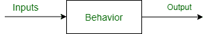
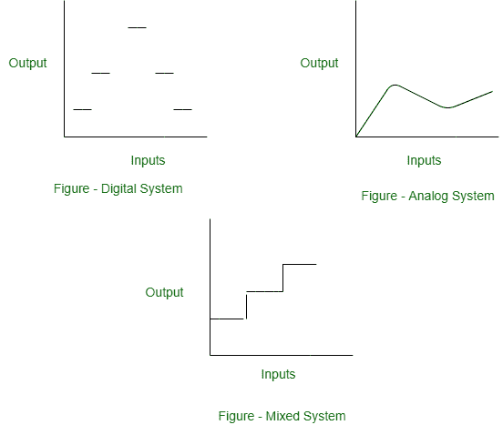

# 数字系统介绍

> 原文:[https://www . geesforgeks . org/数字系统介绍/](https://www.geeksforgeeks.org/introduction-to-digital-systems/)

系统是作为一个整体工作以实现目标的一组相关组件。系统包含输入、行为和输出。

行为是一个将输入转化为输出的函数。

组件是电子模块——数字、模拟或混合信号。数字系统是信号具有有限数量离散值的系统。模拟系统有连续设置的值，混合信号系统有数字和模拟部分。

通常，信号由两种方法表示，即数字和模拟系统。数字信号仅限于少数可能的值，通常由二进制逻辑 0(0–0.8 伏)和逻辑 1(2.0–5.0 伏)表示。而模拟信号连续变化。