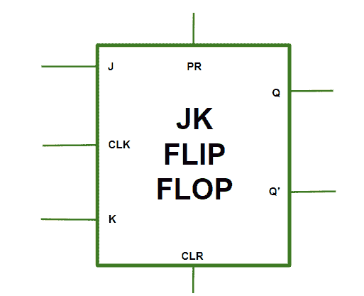
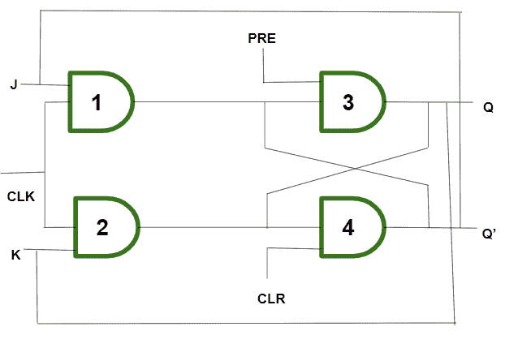
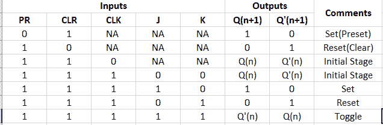
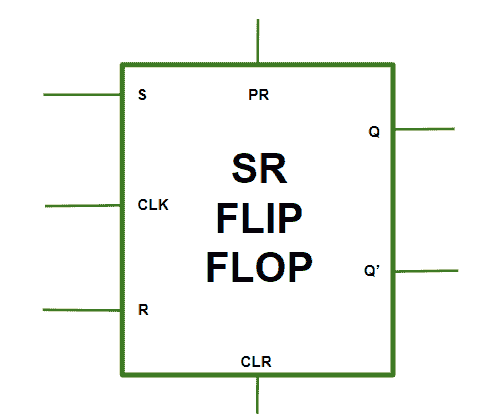
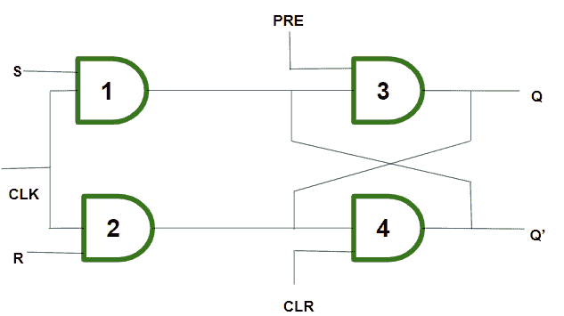
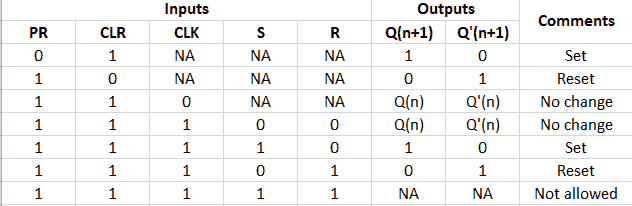

# JK 触发器和 SR 触发器

> 原文:[https://www . geesforgeks . org/JK-触发器和-Sr-触发器/](https://www.geeksforgeeks.org/jk-flip-flop-and-sr-flip-flop/)

[触发器](https://www.geeksforgeeks.org/flip-flop-types-their-conversion-and-applications/)俗称基础数字存储电路。它有两种状态，即逻辑 1(高)和逻辑 0(低)状态。触发器是由信息或数据的单一二进制状态组成的时序电路。数字电路是一个触发器，有两个输出，状态相反。它也被称为双稳态多谐振荡器。

**1。JK 触发器:**
下面的 JK 触发器图代表了由 Clock (CLK)、Clear (CLR)和 Preset (PR)组成的基本结构。



**JK 触发器中的操作–**

*   **Case-1:**

    ```
    PR = CLR = 0 
    ```

    这种情况处于无效状态。

*   **Case-2:**

    ```
    PR = 0 and CLR = 1 
    ```

    PR 被激活，这意味着 Q 中的输出被设置为 1。因此，触发器处于置位状态。

*   **Case-3:**

    ```
    PR = 1 and CLR = 0 
    ```

    CLR 被激活，这意味着 Q’中的输出被设置为 1。因此，触发器处于复位状态。

*   **Case-4:**

    ```
    PR = CLR = 1 
    ```

    在这种情况下，触发器以其正常方式工作，而 PR 和 CLR 被去激活。

**JK 触发器，表示预设和清除–**



**JK 触发器真值表–**



**JK 触发器中的“绕圈”条件–**
当 J 和 K 都设置为 1 时，输入在较长时间内保持高电平，然后输出继续切换。切换意味着立即切换输出，即 Q = 0，Q' = 1 将立即变为 Q = 1 和 Q' = 0，并且这种连续性会不断变化。输出的这种变化导致了竞争条件。

**2。SR 触发器:**
在 SR 触发器中，借助于 Preset 和 Clear，当电源接通时，电路的状态不断变化，即不确定。它可能会进入设置(Q = 1)或重置(Q' = 0)状态。在许多应用中，最初需要置位或复位触发器。这是通过预设和清除来完成的。



**SR 触发器中的操作–**

*   **Case-1:**

    ```
    PR = CLR = 1 
    ```

    异步输入无效，触发器以正常方式自由响应 S、R 和 CLK 输入。

*   **Case-2:**

    ```
    PR = 0 and CLR = 1 
    ```

    当 Q 设置为 1 时使用。

*   **Case-3:**

    ```
    PR = 1 and CLR = 0 
    ```

    当 Q’设置为 1 时使用。

*   **Case-4:**

    ```
    PR = CLR = 0 
    ```

    这是无效状态。

**SR 触发器，表示预设和清除–**



**SR 触发器真值表–**



**触发器的应用:**

1.  触发器被用作消除弹跳的开关。
2.  它们用作串行到并行和并行到串行转换。
3.  它用于计数器。
4.  它用于分频器，也用作锁存器。