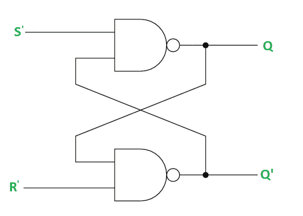
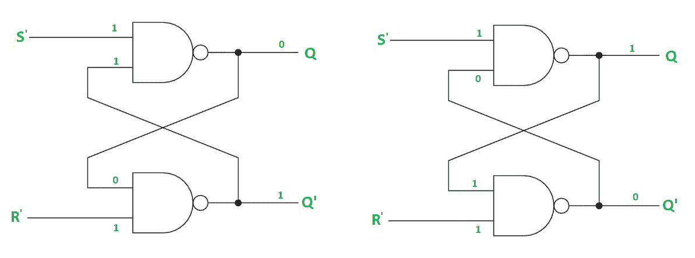
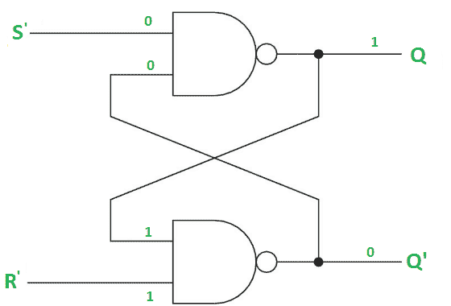
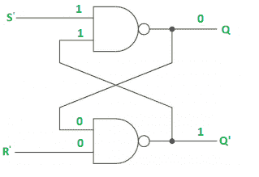
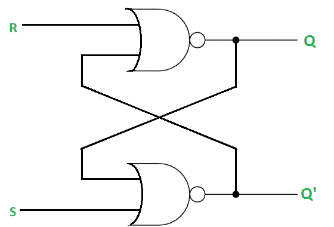
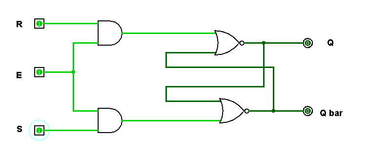
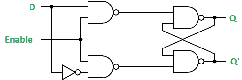

# 数字逻辑中的锁存器

> 原文:[https://www.geeksforgeeks.org/latches-in-digital-logic/](https://www.geeksforgeeks.org/latches-in-digital-logic/)

锁存器是以信号电平(而不是信号转换)工作的基本存储元件。由时钟转换控制的锁存器是[触发器](https://www.geeksforgeeks.org/flip-flop-types-and-their-conversion/)。锁存器是电平敏感器件。锁存器对于[异步时序电路](https://www.geeksforgeeks.org/digital-logic-asynchronous-sequential-circuits/)的设计很有用。

**SR(置位-复位)锁存器–**SR 锁存器是一个电路，具有:
(i) 2 个交叉耦合的或非门或 2 个交叉耦合的与非门。
(ii) 2 个输入 S 用于设置，R 用于重置。
(三)2 输出 Q，Q’。

<figure class="table">

| Q | q ' | 状态 |
| --- | --- | --- |
| one | Zero | 一组 |
| Zero | one | 重置 |

正常情况下，两个输入都保持为 0。以下是带与非门的 RS 锁存器:



**情况-1:S ' = R ' = 1(S = R = 0)–**
如果 Q = 1，则第二与非门的 Q 和 R '输入均为 1。
如果 Q = 0，第二与非门的 Q 和 R’输入分别为 0 和 1。



**情况-2: S'=0，R'=1 (S=1，R = 0)–**
As S ' = 0，第 1 与非门的输出，Q = 1( **置位状态**)。在第二与非门中，由于 Q 和 R’输入为 1，Q’= 0。



**情况-3: S'= 1，R'= 0 (S=0，R = 1)–**
作为 R'= 0，第二与非门的输出，Q' = 1。在第一个与非门中，当 Q 和 S 的输入为 1 时，Q=0( **复位状态**)。



**情况-4:S ' = R ' = 0(S=R=1)–**
当 S = R = 1 时，Q 和 Q '都变为 1，这是不允许的。所以，禁止输入条件。

使用或非门的 SR 锁存器如下所示:



**门控 SR 锁存器–**
门控 SR 锁存器是一种带使能输入的 SR 锁存器，当使能为 1 时工作，当使能为 0 时保持先前状态。



**门控 D 闩锁–**
D 闩锁类似于 SR 闩锁，但做了一些修改。在这里，输入是相互补充的。具有使能信号的 D 锁存器的设计如下:



D 锁存器的真值表如下所示:

<figure class="table">

| 使能够 | D | Q(n) | Q(n+1) | 状态 |
| --- | --- | --- | --- | --- |
| one | Zero | x | Zero | 重置 |
| one | one | x | one | 设置 |
| Zero | x | x | Q(n) | 无变化 |

由于输出与输入 D 相同，D 锁存器也称为*透明锁存器*。考虑真值表，具有使能输入的 D 锁存器的特性方程可以给出为:

```
Q(n+1) = EN.D + EN'.Q(n)
```

**参考:**
数字电子-阿图尔·p·戈泽，迪帕利·a·戈泽夫人

</figure>

</figure>