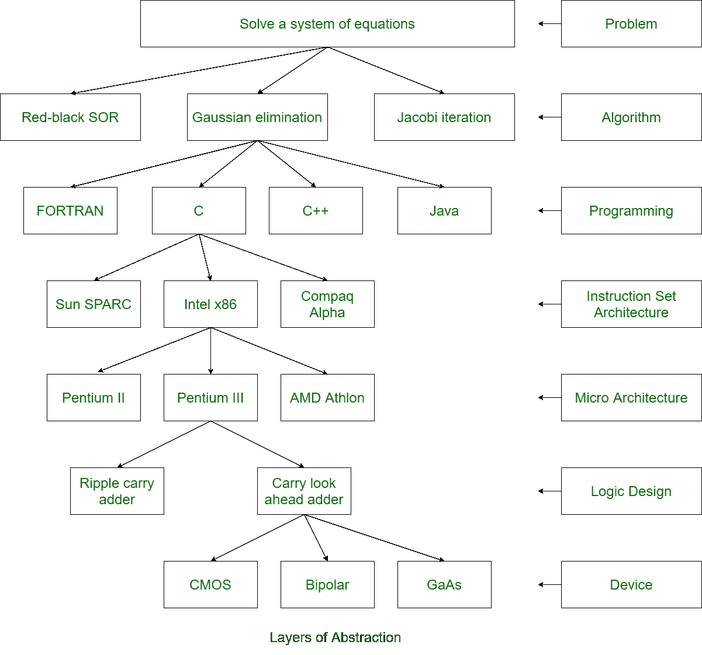

# 计算机系统中的抽象层

> 原文:[https://www . geeksforgeeks . org/计算机系统抽象层/](https://www.geeksforgeeks.org/layers-of-abstraction-in-computer-system/)

计算机系统分为两个功能实体。硬件和软件是计算机系统的两个功能实体。操作系统是连接硬件和软件的纽带。计算机系统中有一定的层次，进程通过这些层次来执行任务。这里我们将讨论每一层。

以下是计算机系统中不同的抽象层:

*   **问题陈述–**
    问题陈述使用自然语言陈述。它可能是模糊的或不精确的。它基本上是用户对系统的要求。
*   **算法–**
    算法是执行特定任务的分步程序。保证完成。它具有确定性、有效可计算性和有限性。

*   **程序–**
    程序使用高级语言和低级语言等计算机语言来表达算法。用户为他们的问题陈述编写代码。*   **指令集架构–**
    指令集架构指定了计算机可以使用数据类型和寻址模式执行的指令集。*   **微架构–**
    微架构是处理器实现的详细组织。*   **逻辑电路–**
    逻辑电路结合基本运算实现微架构。*   **Device –**
    Device has the properties of materials and manufacturability.

    