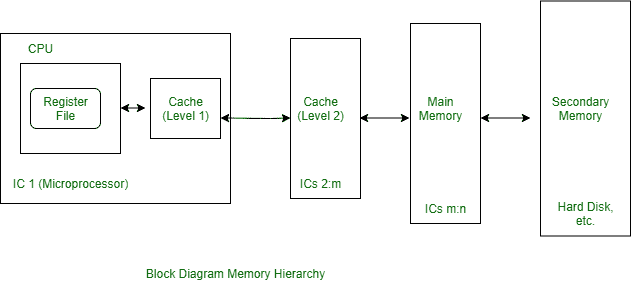

# 操作系统中的内存级别

> 原文:[https://www . geesforgeks . org/操作系统内存级别/](https://www.geeksforgeeks.org/levels-of-memory-in-operating-system/)

[计算机系统的内存层次](https://www.geeksforgeeks.org/memory-hierarchy-design-and-its-characteristics/)它处理速度上的差异。“层次”是一个很好的方式来表达“思考的顺序”，比如从上到下，从快到慢，从最重要到最不重要。

如果你看看计算机内部的内存层次结构，按照最快到最慢:

```
1. CPU Registers
2. Caches memory
3. Main or Primary Memory
4. Secondary Memory 
```



这些解释如下。

1.  **[CPU Register](https://www.geeksforgeeks.org/different-classes-of-cpu-registers/):**
    These high speed registers in CPU serve as working memory for instruction and temporary storage of data. Typically, they create a general purpose register file to store data as it is processed. The capacity of 32 data words is typical of a register file, and each register can be read or written from within a single clock cycle.
2.  **[Caches Memory](https://www.geeksforgeeks.org/cache-memory-in-computer-organization/):**
    Now a days, most computers contain another level of IC memory- sometimes several such levels- Known as cache memory, that is positioned logically between the CPU registers and main memory. storage capacity of a cache is less than of main memory, but with an access time of one to three cycles, the cache is much faster than main memory because some or all of it can reside on the same IC as the CPU.

    For high performance computers, caches are essential components. Unlike the other three types of memory, the cache is usually transparent to programmers. Simultaneously, a computes cache and main memory implement directly mapped external memory by the instructions of the CPU.
3.  **[Main or Primary Memory](https://practice.geeksforgeeks.org/problems/explain-primary-memory-secondary-memory-virtual-memory):**
    It is large, fairly fast external memory, which stores programs and data in active use. in main memory, storage locations are addressed directly by the load and store instruction of the CPU. While an IC Technology similar to that of a CPU register file is used, access is slower is due to large capacity of main memory and the fact that it is physically separated from the CPU. Access time of five or more clock cycles are usual.
4.  **[二级内存](https://www.geeksforgeeks.org/introduction-of-secondary-memory/) :**
    二级内存容量很大，但是比内存慢很多。辅助存储器存储系统程序、大数据文件等，这些不是中央处理器一贯需要的。当主存储器的容量。在二级存储器中，信息被认为是在线的，但通过在主存储器和二级存储器之间传输信息的 I/O 程序间接访问。

    二级存储器最常见的例子是磁性硬盘和 cd-r om(光盘只读存储器)，两者都有相对较慢的电存取机制。典型的存储容量为几千兆字节，而访问时间以毫秒为单位。